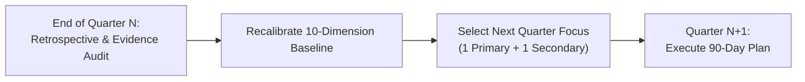
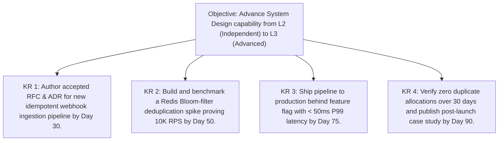

# The Quarterly Engineering Improvement Cadence

> **"A quarter is the fundamental planning horizon of the tech industry. It is long enough to architect, build, and ship a non-trivial subsystem, and short enough to evaluate its real-world production outcome."**

---

## 1. Overview of the Quarterly Cadence

The **Quarterly Improvement Cadence** aligns personal capability expansion with the organization's business OKRs and roadmap milestones. Every quarter represents one complete execution of the **90-Day Improvement Cycle**, transitioning an engineer from gap diagnosis to production evidence.

---

## 2. Setting Quarterly Engineering Capability OKRs

Never set vague, unmeasurable learning goals (e.g., *"Learn more about distributed systems"*). Structure quarterly development goals using the **Objective & Key Results (OKR)** framework:

### Guidelines for High-Rigor Engineering OKRs:
1. **At Least One Key Result Must Be an Artifact**: An accepted ADR, an RFC, or a published runbook.
2. **At Least One Key Result Must Be a Production Metric**: P99 latency reduction, error budget compliance, zero regressions.
3. **No Credentialist Key Results**: Do not use "complete course X" or "read book Y" as Key Results; use the *application* of that knowledge as the metric.

---

## 3. The Quarterly Retrospective & Transition Ritual

At the conclusion of each quarter (typically during the final two weeks):
1. **Score the Outgoing 90-Day Plan**:
   - Evaluate completion of Key Results.
   - Did the primary dimension advance to the target maturity level on the [Maturity Rubric](../capability-matrix/maturity-levels.md)?
2. **Update the Portfolio Dossier**:
   - Compile the quarter's CPOE entries into a dedicated project dossier in `dossiers/`.
   - Obtain formal peer/lead sign-off on the evidence ledger.
3. **Run the Gap Analysis**:
   - Re-run the [Capability Gap Analysis](../assessment/capability-gap-analysis.md).
   - Formulate the next [90-Day Improvement Plan](./90-day-improvement-plan.md).
