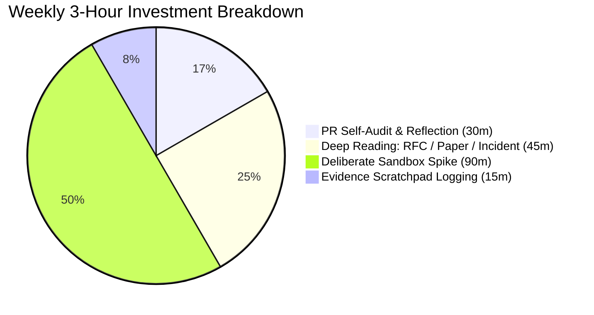
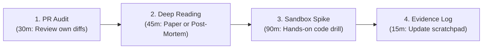

# The Weekly Engineering Improvement Loop

> **"If you only write code for your current sprint tickets, you are renting your skills to your employer while your underlying capability quietly depreciates."**

---

## 1. The 3-Hour Weekly Investment

The **Weekly Improvement Loop** is a protected 2-to-3 hour time block—ideally scheduled for Friday afternoons—dedicated exclusively to deliberate practice, reflection, and technical sharpening. 

It prevents the chronic trap of the "Jira Treadmill," where an engineer spends 40 hours a week shipping features without ever sharpening the saw:



---

## 2. The 4 Stages of the Friday Ritual



### Stage 1: The PR Self-Audit (30 Minutes)
Re-read your own merged pull requests from the past week with the dispassionate eye of an external reviewer:
- *Did I introduce unnecessary complexity or indirection?*
- *Did I write real integration tests, or did I over-mock the database?*
- *Are variable and function names self-revealing, or will someone be confused in 6 months?*
- *What PR comments did my peers leave? Did I address the root concern or just apply a quick patch?*

### Stage 2: Deep Technical Reading (45 Minutes)
Read one authoritative, high-signal technical artifact:
- **An Industry Post-Mortem**: Study how real-world companies failed (e.g., AWS S3 outage, Cloudflare BGP route leak, GitHub database failover).
- **A Foundational Paper**: Read classical systems papers (e.g., Lamport’s *Time, Clocks, and the Ordering of Events*, Google’s *Chubby*, or Amazon’s *Dynamo*).
- **An Internal RFC / ADR**: Read a major design document from another squad in your company to understand cross-domain patterns.

### Stage 3: The Deliberate Sandbox Spike (90 Minutes)
Build an isolated, failure-tolerant code experiment (see [Engineering Challenges](../challenges/)):
- **Performance Profiling**: Run `pprof` or `async-profiler` against a toy HTTP server; generate flamegraphs; eliminate heap allocations in a hot loop.
- **Concurrency Drill**: Write a thread-safe bounded ring buffer from scratch in Go or Rust; verify thread safety under high synthetic contention.
- **Chaos Drill**: Spin up a Docker Compose network with Toxiproxy; inject 200ms latency and 20% packet drops; verify that your circuit-breaker library trips properly.

### Stage 4: Evidence Scratchpad Logging (15 Minutes)
Append raw artifact URLs to your weekly portfolio scratchpad:
- Links to clean PRs merged this week.
- Notes from any production incident triage.
- Key takeaways from your reading and sandbox spikes.

---

## 3. Weekly Improvement Checklist

```markdown
### Friday Engineering Loop Checklist

- [ ] Reviewed my own merged PRs from the sprint; identified 1 area for code cleanliness improvement.
- [ ] Read 1 external technical post-mortem or computer science paper.
- [ ] Built an isolated technical spike in a local sandbox or test repository.
- [ ] Captured all notable PR diffs and incident links in my raw evidence scratchpad.
- [ ] Left at least 2 high-signal, pedagogical reviews on teammates' pull requests this week.
```
