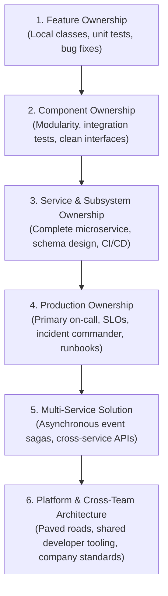

# Practical Engineering Experience Framework

> **"Experience is not the number of years you have spent sitting in front of an IDE. Experience is the catalog of failure modes you have navigated, the architectural decisions you have defended, and the production systems you have operated."**

This directory defines the **Practical Experience Framework** of **Domain 25 — Software Engineer Excellence**. It provides a structured experience ladder and catalogs high-leverage project, operational, architectural, and leadership milestones that software engineers should intentionally seek out.

---

## Directory Documents

| Document | Focus & Scope | Core Question Answered |
| :--- | :--- | :--- |
| **[experience-ladder.md](./experience-ladder.md)** | Scope Expansion Ladder | *How does an engineer's operational ownership progress from single functions to multi-service platforms?* |
| **[project-experiences.md](./project-experiences.md)** | Project Archetypes Catalog | *What high-value engineering projects should I take on to demonstrate Senior and Lead capability?* |
| **[production-experiences.md](./production-experiences.md)** | Production Milestones | *What operational battles (on-call, P1 incidents, SLOs, chaos drills) must I navigate to build resilience?* |
| **[architecture-experiences.md](./architecture-experiences.md)** | Architectural Milestones | *How do I earn my architectural stripes (first ADR, legacy strangler migration, RFC defense)?* |
| **[leadership-experiences.md](./leadership-experiences.md)** | Leadership Milestones | *What initiatives prove leadership without authority, team multiplication, and paved road adoption?* |

---

## The Practical Experience Ladder

Every milestone documented in this directory generates verifiable Tier 3 artifacts that feed directly into the [Engineering Evidence Portfolio](../evidence/engineering-portfolio.md).
