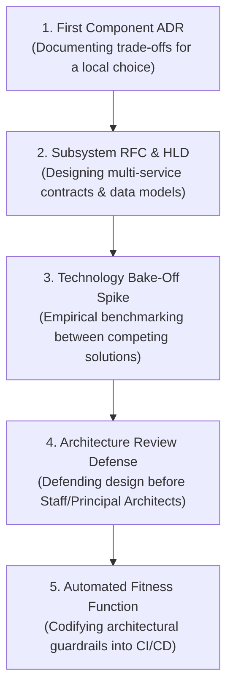

# Architectural Experiences & Milestones

> **"Architectural maturity is not achieved by reading books on architecture. It is achieved by defending an ADR under intense peer interrogation, watching a system scale under your design, and living with the operational consequences of your trade-offs."**

---

## 1. Architectural Progression in Practical Work

In high-performing engineering organizations, architecture is not an ivory-tower activity isolated from implementation. Every senior engineer is an active architect at the component and subsystem level. 

This catalog details **five foundational architectural milestones** that transition an engineer from a consumer of designs into a creator of defensible architectures:

---

## 2. The 5 Foundational Architectural Milestones

### Milestone 1: Authoring Your First Architecture Decision Record (ADR)
- **Context**: The team needs to choose a critical technical approach (e.g., choosing between JSON vs. Protobuf for an internal event topic, or Redis vs. an in-memory cache).
- **Architectural Thinking**: Recognizing that every decision involves sacrifice; rejecting the illusion of a "perfect" technology; documenting negative consequences upfront.
- **Step-by-Step Execution**:
  1. Use the lightweight ADR format (Title, Status, Context, Decision, Consequences).
  2. Explicitly articulate the evaluated alternatives that were rejected, and provide empirical reasons why.
  3. Document what technical debt or operational burden is accepted as a result of this decision.
  4. Submit the ADR as a markdown pull request; iterate based on peer feedback; merge to `docs/adr/`.
- **Verifiable Evidence**: Accepted ADR merged to the repository with a detailed peer review comment thread.

### Milestone 2: Authoring a Subsystem High-Level Design (HLD / RFC)
- **Context**: The squad is embarking on a multi-month initiative to build a new domain service (e.g., a Notification Dispatcher or Fraud Scoring Engine).
- **Architectural Thinking**: System decomposition, bounded contexts, API contract versioning, distributed state management, and capacity modeling.
- **Step-by-Step Execution**:
  1. Draft a comprehensive RFC covering: Problem Statement, Non-Functional Requirements (P99, RPS, RTO/RPO), C4 System Diagrams, Database Schema, and API Endpoints.
  2. Model capacity requirements: calculate storage growth over 3 years, network bandwidth, and compute requirements.
  3. Circulate asynchronously for 1 week; host a design walk-through meeting; capture dissent and reach consensus.
- **Verifiable Evidence**: Published and approved RFC document (Markdown/Google Doc) signed off by Tech Leads and Product Managers.

### Milestone 3: Conducting an Empirical Technology Bake-Off Spike
- **Context**: A heated debate erupts on the team regarding which technology to adopt (e.g., Kafka vs. RabbitMQ, or PostgreSQL vs. MongoDB) based on differing subjective opinions.
- **Architectural Thinking**: Replacing subjective arguments with empirical, benchmarked evidence; building minimal isolated spikes to test specific hypotheses under production-like constraints.
- **Step-by-Step Execution**:
  1. Define 3 non-negotiable evaluation criteria (e.g., write latency under 10K RPS, recovery time after node crash, ease of schema evolution).
  2. Build two identical sandbox spikes using Docker Compose.
  3. Benchmark both using automated load scripts (`k6`); inject network partitions and monitor CPU/memory footprint.
  4. Publish a comparison report with flamegraphs, latency percentiles, and operational complexity scores.
- **Verifiable Evidence**: Reproducible benchmarking repository and comparison matrix document justifying the final recommendation.

### Milestone 4: Defending a Design at an Architecture Review Board (ARB)
- **Context**: Presenting a major architectural proposal before a council of Staff Engineers, Principal Architects, and Security Leads.
- **Architectural Thinking**: Executive communication, psychological composure, handling technical scrutiny without defensiveness, and acknowledging unknowns openly.
- **Step-by-Step Execution**:
  1. Distribute pre-read materials (RFC and ADRs) at least 48 hours prior to the review meeting.
  2. Open with the business problem and NFR constraints before diving into technical diagrams.
  3. When challenged on an edge case: acknowledge the risk, present evaluated mitigations, and offer to benchmark if uncertain.
  4. Document all review action items and update the architecture specification accordingly.
- **Verifiable Evidence**: Architecture Review Board minutes recording formal approval, accompanied by updated RFC reflecting committee feedback.

### Milestone 5: Designing an Automated Architectural Fitness Function
- **Context**: Architectural standards (such as layered architecture boundaries or package isolation) degrade over time as developers cut corners or make inadvertent imports.
- **Architectural Thinking**: Evolutionary architecture; replacing manual code review policing with automated, executable architectural guardrails.
- **Step-by-Step Execution**:
  1. Identify a critical architectural invariant (e.g., "The Domain Entity layer must never import or depend on the Database or HTTP Presentation layer").
  2. Implement an automated fitness function in the test suite using tools like ArchUnit (Java), Arch-Go (Go), or custom AST linting rules.
  3. Integrate the check into the CI build pipeline so any violating pull request fails automatically with a clear diagnostic explanation.
- **Verifiable Evidence**: CI pipeline check blocking unauthorized imports, accompanied by zero false positives over 90 days.
