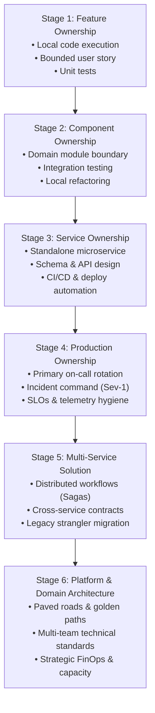

# The Practical Engineering Experience Ladder

> **"You cannot skip steps on the experience ladder without creating brittle engineering capability. An architect who never owned a service in production designs unmaintainable systems; a lead engineer who never refactored a legacy mess cannot coach junior developers through technical debt."**

---

## 1. The 6-Stage Engineering Experience Ladder

The **Experience Ladder** models the progressive expansion of an engineer's sphere of accountability, operational reality, and technical ownership:

---

## 2. Stage-by-Stage Forensic Breakdown

### Stage 1: Feature Ownership
- **Expected Scope**: Delivering bounded user stories and bug fixes within an established codebase.
- **Typical Problems Solved**: Implementing a new REST endpoint, fixing an off-by-one edge case, parsing an incoming JSON payload.
- **Key Decisions**: Selecting appropriate data structures (map vs. slice), structuring function signatures, naming variables.
- **Primary Evidence**: Merged pull requests ($< 250$ lines), passing unit test suites.
- **Failure Modes / Risks**: Relying on manual UI testing; failing to consider null/empty inputs; writing untestable spaghetti code.
- **Readiness to Advance**: Consistently ships features on schedule with zero QA defects or regressions.

### Stage 2: Component Ownership
- **Expected Scope**: Owning a cohesive logical module or library within an application (e.g., the Authentication Middleware or the Pricing Calculation Engine).
- **Typical Problems Solved**: Refactoring high-complexity legacy methods; defining clean domain interfaces; introducing dependency injection.
- **Key Decisions**: Choosing between inheritance vs. composition; defining public API boundaries; selecting test doubles (fakes vs. mocks).
- **Primary Evidence**: Refactoring pull request diffs, automated integration test suites running with testcontainers.
- **Failure Modes / Risks**: Over-abstracting simple logic; circular package dependencies; mocking out everything in tests.
- **Readiness to Advance**: Demonstrates ability to rewrite and test internal component logic without breaking external consumers.

### Stage 3: Service Ownership
- **Expected Scope**: Complete lifecycle ownership of an independent production microservice or major monolithic domain context.
- **Typical Problems Solved**: Designing database schemas (relational or NoSQL); building CI/CD deployment pipelines; handling containerization (Docker/K8s).
- **Key Decisions**: Database selection; API protocol (REST vs. gRPC); synchronous vs. asynchronous execution; indexing strategies.
- **Primary Evidence**: Architecture Decision Record (ADR), CI/CD pipeline definitions, OpenAPI/Protobuf specifications.
- **Failure Modes / Risks**: Unindexed database queries causing table scans; microservice boundary misaligned with business domains.
- **Readiness to Advance**: Service runs reliably in staging and production with zero manual deployment steps.

### Stage 4: Production Ownership
- **Expected Scope**: Being directly accountable for the uptime, latency, error budgets, and operational resilience of services in production.
- **Typical Problems Solved**: Diagnosing live production deadlocks; mitigating connection pool exhaustion; handling Sev-1 outages; tuning garbage collection.
- **Key Decisions**: Setting SLIs/SLOs and alert thresholds; deciding whether to roll back or dark-launch during an outage; tuning thread pools.
- **Primary Evidence**: Published blameless incident post-mortems, Datadog/Grafana SLO dashboards, operational runbooks.
- **Failure Modes / Risks**: Alert fatigue (ignoring pings); panicking during outages; blaming human error in retrospectives.
- **Readiness to Advance**: Successfully acts as Incident Commander for a Sev-1 incident, restoring service in $< 20\text{ minutes}$ with zero repeat occurrences.

### Stage 5: Multi-Service Solution
- **Expected Scope**: Architecting workflows spanning multiple independent services, asynchronous message brokers, and third-party integrations.
- **Typical Problems Solved**: Implementing distributed Sagas with compensating transactions; designing transactional outboxes; executing legacy strangler migrations.
- **Key Decisions**: Choreographed vs. orchestrated sagas; at-least-once vs. effectively-once processing; backward/forward contract compatibility.
- **Primary Evidence**: High-Level Design (HLD) RFC, zero-downtime migration dashboard, chaos testing resilience report.
- **Failure Modes / Risks**: Distributed deadlocks; data inconsistency between microservices; cascading failures under network partitions.
- **Readiness to Advance**: Delivers a multi-service business initiative with zero customer-facing data loss or downtime.

### Stage 6: Platform & Domain Architecture
- **Expected Scope**: Setting architectural standards, building paved roads, and governing systems across 3+ squads.
- **Typical Problems Solved**: Eliminating systemic developer friction; standardizing company-wide event schemas; reducing cloud infrastructure costs.
- **Key Decisions**: Buy vs. build; framework and language ecosystem standardization; platform-as-a-product investment.
- **Primary Evidence**: Adopted developer CLI/template, cross-team RFCs, cloud FinOps cost reduction reports.
- **Failure Modes / Risks**: Building ivory-tower platforms that no squad adopts; mandating dogmatic standards that kill team velocity.
- **Readiness to Advance**: Prepares the engineer for formal transition to dedicated Solution Architecture (see [24-architect-mastery/career/lead-engineer-to-solution-architect.md](../../24-architect-mastery/career/lead-engineer-to-solution-architect.md)).
