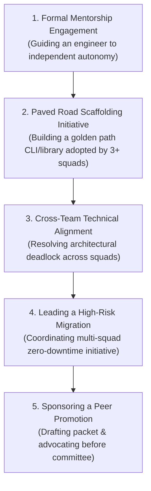

# Leadership & Multiplier Experiences

> **"True leadership in software engineering is the art of achieving voluntary technical alignment, building tools that make other engineers 2x faster, and coaching peers so effectively that they eventually surpass you."**

---

## 1. The Multiplier Milestones

To advance from a capable Individual Contributor (L2/L3) to an organizational force multiplier (L4 Lead/Staff Engineer), an engineer must move beyond personal task delivery. They must demonstrate **leadership without authority** by shaping tools, standards, and human capabilities across multiple squads.

This catalog details **five foundational leadership milestones**:

---

## 2. The 5 Foundational Leadership Milestones

### Milestone 1: Structuring a Formal 6-Month Mentorship Engagement
- **Context**: A junior or mid-level engineer is struggling to advance from assisted task execution to autonomous feature delivery.
- **Leadership Dynamic**: Socratic coaching over directive typing; resisting the urge to take over when the mentee struggles; creating safe failure boundaries.
- **Step-by-Step Execution**:
  1. Establish a bi-weekly 45-minute 1-on-1 cadence focused on capability growth rather than sprint status updates.
  2. Co-create a tailored [Individual Development Plan](../development-plans/individual-development-plan.md) targeting the mentee's primary constraint.
  3. Conduct pedagogical pair-programming sessions on complex domain logic and integration test design.
  4. Delegate a stretch architectural component to the mentee, providing review guardrails while allowing them to lead the implementation.
- **Verifiable Evidence**: Mentee's before-and-after capability audit, testimonials, and successful promotion documentation.

### Milestone 2: Building and Championing a Paved Road (Golden Path)
- **Context**: Every squad in the company invents its own bespoke way to configure microservices, set up CI pipelines, and connect to telemetry, causing massive cognitive friction.
- **Leadership Dynamic**: Product management applied to internal developer tools; listening to developer pain; driving voluntary adoption through superior ergonomics rather than executive mandate.
- **Step-by-Step Execution**:
  1. Interview engineers across 4 squads to catalog the top 3 developer onboarding and provisioning pain points.
  2. Build an internal developer CLI, starter template, or shared library that automates service bootstrapping, OpenTelemetry integration, and Dockerfile optimization.
  3. Pilot the template with one friendly squad; incorporate their feedback; document clear guides and run a brown-bag demonstration.
  4. Measure adoption metrics and developer time saved.
- **Verifiable Evidence**: Git repository analytics showing adoption across $\ge 3$ squads, accompanied by survey data showing $> 60\%$ reduction in new service onboarding time.

### Milestone 3: Resolving Cross-Team Architectural Conflict
- **Context**: Two squads are deadlocked over an inter-service API contract (e.g., synchronous REST polling vs. asynchronous event streaming), delaying a critical quarterly business initiative.
- **Leadership Dynamic**: Technical diplomacy; depersonalizing the conflict; reframing the dispute around business NFRs (latency, cost, throughput, team cognitive load) rather than pride.
- **Step-by-Step Execution**:
  1. Convene a structured, blameless alignment workshop with technical leads from both teams.
  2. Map out both proposed options side-by-side on an objective trade-off matrix against agreed business NFRs.
  3. Build an empirical prototype or benchmark if consensus cannot be reached theoretically.
  4. Draft a mutually agreed RFC capturing the consensus decision, and obtain written commitment from both leads.
- **Verifiable Evidence**: Jointly signed cross-team RFC and on-time delivery of the integrated capability.

### Milestone 4: Leading a Multi-Squad Zero-Downtime Migration
- **Context**: A legacy core database or authentication service needs to be replaced across 4 squads serving 10 million active users with zero scheduled downtime.
- **Leadership Dynamic**: Risk mitigation, horizontal coordination, transparent communication, and maintaining calm during high-stakes cutovers.
- **Step-by-Step Execution**:
  1. Formulate a multi-phase migration blueprint (Dual-Write $\to$ Backfill $\to$ Shadow Read $\to$ Cutover).
  2. Establish a cross-squad coordination channel, weekly standup, and shared milestone burndown.
  3. Lead simulated cutover dry-runs in staging environments.
  4. Command the live production cutover, monitoring real-time telemetry dashboards and verifying zero data divergence.
- **Verifiable Evidence**: Published migration post-launch report, Grafana cutover telemetry, and zero customer-reported defects.

### Milestone 5: Sponsoring a Peer for Career Promotion
- **Context**: A senior colleague has been performing at the next level but lacks the visibility or structured portfolio required to navigate the promotion committee.
- **Leadership Dynamic**: Active talent advocacy; assembling objective evidentiary dossiers; presenting a compelling, unassailable promotion case.
- **Step-by-Step Execution**:
  1. Review the candidate’s work against the [Role Capability Matrix](../capability-matrix/role-capability-matrix.md).
  2. Help the candidate assemble a verified [Promotion Readiness Dossier](../assessment/readiness-assessment.md) backed by Tier 3 evidence.
  3. Write a rigorous sponsor letter articulating the candidate's cross-team impact, operational reliability, and force-multiplier effect.
  4. Defend the candidate before the Engineering Promotion Committee.
- **Verifiable Evidence**: Formal promotion packet submission and ratified committee promotion decision.
