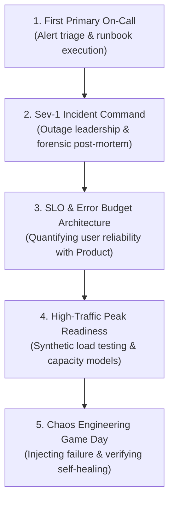

# Production Engineering Experiences & Milestones

> **"Until your code has broken in production at 3:00 AM, paged you out of a deep sleep, and forced you to diagnose a distributed failure under extreme pressure, your engineering education has not truly begun."**

---

## 1. The Operational Crucible

Software engineering is fundamentally an operational discipline. The true quality of an architecture is not revealed on a pristine local development machine; it is revealed under the harsh, chaotic conditions of live production traffic, flaky networks, cloud hypervisor restarts, and sudden traffic surges.

This catalog details **five foundational production milestones** that every software engineer must navigate to achieve senior operational maturity:

---

## 2. The 5 Foundational Production Milestones

### Milestone 1: The First Primary On-Call Rotation
- **Context**: Transitioning from shadowing a senior engineer to holding primary responsibility for production pager alerts across team services.
- **Skills Cultivated**: Rapid alert triage, differentiating between transient network blips and critical systemic failures, suppressing alert panic, and following runbooks under pressure.
- **Step-by-Step Execution**:
  1. Audit team runbooks prior to the shift; ensure all alert links lead to active documentation.
  2. Verify local access to VPN, staging clusters, bastion hosts, and telemetry portals.
  3. When an alert fires: acknowledge within 5 minutes, inspect the triggering metric, check recent deployments, and mitigate before diagnosing root cause.
  4. Log all false-positive or non-actionable alerts and tune thresholds post-shift.
- **Verifiable Evidence**: PagerDuty shift log showing 100% on-time acknowledgment; ticket links for alert tuning PRs submitted after the rotation.

### Milestone 2: Sev-1 Incident Command & Forensics
- **Context**: A critical, revenue-impacting outage occurs (e.g., checkout endpoint returning HTTP 500 across all regions). The engineer steps up as **Incident Commander (IC)**.
- **Skills Cultivated**: Crisis communication, psychological composure, delegating diagnostic tasks, resisting premature conclusions, and authoring blameless post-mortems.
- **Step-by-Step Execution**:
  1. Establish a centralized triage communication channel; state: *"I am stepping in as Incident Commander."*
  2. Designate a Scribe (to log the timeline) and a Technical Lead (to test hypotheses).
  3. Shield responders from executive interruptions by providing periodic 15-minute status updates.
  4. Prioritize immediate mitigation (e.g., toggling feature flags or rolling back the last deploy) over deep root-cause forensics.
  5. Convene a blameless post-mortem meeting within 48 hours; identify systemic contributing factors and create permanent architectural remediation tickets.
- **Verifiable Evidence**: Published blameless incident post-mortem containing full timeline, root-cause analysis, and merged remediation pull requests.

### Milestone 3: SLO & Error Budget Implementation
- **Context**: A service suffers from constant alert noise and subjective arguments between engineering and product about whether the system is "stable enough."
- **Skills Cultivated**: Cross-functional alignment, SLI formulation, Prometheus/Datadog metric design, and error-budget policy enforcement.
- **Step-by-Step Execution**:
  1. Map the critical user journey (e.g., "User adds product to cart and receives confirmation").
  2. Define the Service Level Indicator (SLI):
     $$\text{SLI} = \frac{\text{Successful HTTP Requests with Latency} < 100\text{ms}}{\text{Total Valid HTTP Requests}} \times 100$$
  3. Agree on the Service Level Objective (SLO) with Product Management (e.g., $99.9\%$ over a rolling 30-day window).
  4. Implement multi-window multi-burn-rate alerts (alerting on 1-hour and 6-hour error budget burn rates rather than raw spikes).
- **Verifiable Evidence**: Published SLO contract document, production Grafana dashboard, and documented error-budget review minutes.

### Milestone 4: High-Traffic Peak Readiness (Game-Day Preparation)
- **Context**: The business is launching a major marketing campaign or holiday flash sale projected to deliver $5\times$ peak traffic.
- **Skills Cultivated**: Capacity planning, database connection pool tuning, synthetic distributed load testing, and bottleneck identification.
- **Step-by-Step Execution**:
  1. Build a mathematical capacity model estimating required database IOPs, network egress, and compute pods at $5\times$ peak traffic.
  2. Construct a realistic synthetic load test using `k6` or `Locust`, simulating user sessions with realistic write/read ratios.
  3. Execute the load test against a scaled staging environment; identify the first subsystem to saturate (usually database connection pools or CPU limits).
  4. Implement mitigations: cache warming, increasing read-replica pools, auto-scaling thresholds.
- **Verifiable Evidence**: Capacity planning RFC, load-test execution reports with latency percentiles, and telemetry proving the production system survived peak traffic with zero downtime.

### Milestone 5: The Chaos Engineering Game Day
- **Context**: Verifying that architectural resilience mechanisms (circuit breakers, retries, auto-scaling) actually function when physical infrastructure fails.
- **Skills Cultivated**: Hypothesis-driven resilience engineering, fault injection, and automated self-healing validation.
- **Step-by-Step Execution**:
  1. Formulate a clear hypothesis: *"When 50% of Payment Gateway pods are terminated abruptly, the upstream service will fail fast via its circuit breaker, route to cached payment methods, and maintain 99.9% availability."*
  2. Schedule a game day in staging; use tools like Chaos Mesh or Toxiproxy to terminate pods and inject 5,000ms latency.
  3. Observe production-like dashboards to verify whether the system self-healed within the predicted threshold.
  4. Document discrepancies where failover was slow or unhandled exceptions escaped to users.
- **Verifiable Evidence**: Chaos test plan, dashboard recordings of the experiment, and PRs hardening observed resilience gaps.
