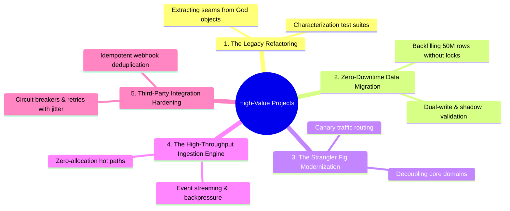

# High-Value Project Experiences Catalog

> **"Career growth is accelerated by the types of problems you choose to work on. Spending five years adding simple endpoints to CRUD services teaches you far less than spending six months strangling a mission-critical legacy monolith."**

---

## 1. Project Archetypes & Career Acceleration

Not all projects produce equal engineering growth. While routine feature additions provide incremental practice, certain **high-leverage project archetypes** expose an engineer to complex trade-offs, severe operational constraints, and deep architectural learning:

---

## 2. The 5 High-Leverage Project Profiles

### Project Archetype 1: The Complex Legacy Refactoring
- **Context**: A business-critical module has accumulated 5 years of patches, has 4,000 lines in a single class (God Object), zero unit tests, and developers are terrified to touch it.
- **Strategic Value**: Proves advanced software craftsmanship, code empathy, refactoring patterns, and testability design.
- **Implementation Strategy**:
  1. Write **Characterization Tests** (Golden Master testing) around the existing module to lock in current behavior before changing a single line of code.
  2. Identify internal architectural seams; introduce interfaces and extract cohesive sub-components using Martin Fowler refactoring patterns.
  3. Replace procedural conditionals with Strategy or State patterns.
  4. Verify zero behavioral regressions across all existing test suites.
- **Verifiable Evidence**: Git PR diff showing a $> 70\%$ reduction in cyclomatic complexity, accompanied by comprehensive automated integration tests.

### Project Archetype 2: The Zero-Downtime High-Scale Data Migration
- **Context**: A 50-million-row database table needs a critical schema transformation (e.g., splitting a monolithic `users` table into `users` and `credentials`, or migrating from MySQL to PostgreSQL) while serving live production traffic.
- **Strategic Value**: Proves production data discipline, backward compatibility, and zero-risk operational execution.
- **Implementation Strategy**:
  1. **Phase 1 (Dual-Write)**: Update application code to write to both the old schema and the new schema in a single transaction.
  2. **Phase 2 (Backfill)**: Run a throttled background worker to backfill historical records in small batches ($1,000\text{ rows}$) with pause intervals to avoid database lock contention and replication lag.
  3. **Phase 3 (Shadow Read / Verification)**: Read from both sources asynchronously and log discrepancies without failing client requests until accuracy reaches $100.000\%$.
  4. **Phase 4 (Cutover & Cleanup)**: Switch primary read traffic to the new schema; deprecate and drop the old tables.
- **Verifiable Evidence**: Accepted migration RFC, backfill monitoring dashboard, and zero customer-facing errors during cutover.

### Project Archetype 3: The Strangler Fig Modernization
- **Context**: An aging monolithic system needs to be broken down, but a big-bang rewrite is guaranteed to fail.
- **Strategic Value**: Proves evolutionary architecture, API gateway routing, and strategic patience.
- **Implementation Strategy**:
  1. Deploy an API Gateway / Reverse Proxy (Envoy / Kong) in front of the legacy monolith.
  2. Build the new microservice implementing a specific bounded context (e.g., Product Catalog).
  3. Intercept catalog requests at the gateway and route 1% of traffic (canary) to the new service.
  4. Monitor error rates and latency, incrementally routing 100% of traffic, then delete the dead legacy code.
- **Verifiable Evidence**: Network routing configuration diff, multi-phase migration timeline, and latency comparison dashboard.

### Project Archetype 4: The High-Throughput Ingestion Engine
- **Context**: An ingestion endpoint struggles under sudden traffic spikes (e.g., IoT telemetry or Black Friday orders), causing memory exhaustion and dropped requests.
- **Strategic Value**: Proves deep mastery of concurrency, non-blocking I/O, queuing topologies, and backpressure.
- **Implementation Strategy**:
  1. Profile runtime allocations; eliminate unnecessary object creations in the request hot path.
  2. Introduce an asynchronous message broker (Kafka/Pulsar) to decouple ingestion from persistence.
  3. Implement backpressure mechanisms (shedding low-priority requests when queues saturate).
- **Verifiable Evidence**: Flamegraph comparison reports, synthetic load-testing benchmarks (`k6`), and production SLO dashboards under peak load.

### Project Archetype 5: Third-Party Integration Hardening
- **Context**: The application depends on an unreliable external SaaS API (e.g., payment gateway, logistics partner) that frequently suffers high latency, timeouts, and network drops.
- **Strategic Value**: Proves defensive distributed systems engineering and fault-tolerant design.
- **Implementation Strategy**:
  1. Wrap all external calls in **Circuit Breakers** (failing fast when downstream is degraded).
  2. Implement **Bulkheads** to isolate HTTP client thread and connection pools.
  3. Enforce **Exponential Backoff with Full Jitter** on idempotent retryable operations.
  4. Store outbound requests in an asynchronous retry queue (Dead Letter Queue / Outbox).
- **Verifiable Evidence**: Chaos test verification report (Toxiproxy), production error rate graphs during third-party outages.
