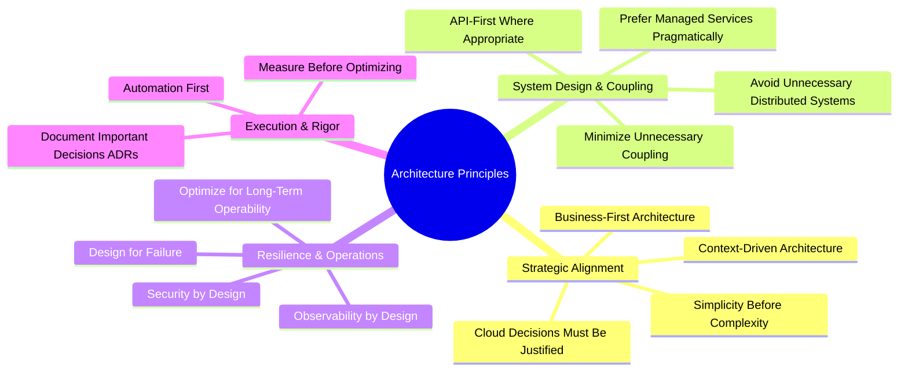

# Enterprise Architecture Principles

This document articulates the 15 non-negotiable architectural principles that govern all solution designs, platform engineering initiatives, and technical decisions documented in this handbook.

---

## The 15 Core Architectural Principles

---

### 1. Business-First Architecture
* **Principle**: Architecture exists solely to unlock business capability, accelerate time-to-value, reduce operational risk, and maximize return on investment (ROI). Technology is never an end in itself.
* **Rationale**: Architectural elegance that fails to deliver business agility, customer delight, or economic efficiency is an expensive distraction. Every architectural investment must tie directly to a measurable business outcome (e.g., revenue growth, churn reduction, compliance, or cost containment).
* **Anti-Pattern / Violation**: "Resume-driven development" (selecting an unproven distributed database or framework simply because it is novel) or building generalized frameworks for hypothetical 5-year business requirements.
* **Architectural Test**: *Can the architect articulate the business outcome and financial justification of this component to a non-technical executive in three sentences?*

---

### 2. Simplicity Before Complexity
* **Principle**: The default architecture is the simplest design that completely satisfies all validated functional and non-functional requirements.
* **Rationale**: Complexity compounds exponentially. Complex systems are harder to reason about, test, secure, operate, and debug at 3:00 AM. Simplicity minimizes cognitive load and drastically lowers total cost of ownership (TCO).
* **Anti-Pattern / Violation**: Introducing microservices or complex event streaming for an internal application serving 50 internal users with modest throughput requirements.
* **Architectural Test**: *What is the simplest architecture that satisfies our p99 SLA, and what evidence proves we must exceed that baseline?*

---

### 3. Architecture Must Be Context-Driven
* **Principle**: There are no universally "correct" architectures; valid solutions are dictated strictly by organization size, team maturity, regulatory environment, latency tolerance, budget, and business timeline.
* **Rationale**: What works for Netflix or Google (10,000+ engineers, hyperscale global traffic) is disastrous for a mid-market enterprise with two 6-person engineering squads.
* **Anti-Pattern / Violation**: Blindly copying the architecture of Silicon Valley tech giants without matching their organizational topology, operational budget, and engineering scale.
* **Architectural Test**: *Does this design match the skills, headcount, operational capacity, and regulatory constraints of the teams actually maintaining it?*

---

### 4. Avoid Unnecessary Distributed Systems
* **Principle**: Keep compute and state co-located within in-process modular boundaries until scale, organizational isolation, or distinct lifecycle requirements mandate physical network partitioning.
* **Rationale**: The first rule of distributed systems is *do not distribute unless you must*. Distributing components introduces network latency, partial failures, serialization overhead, distributed transactions, data consistency challenges, and complex distributed tracing.
* **Anti-Pattern / Violation**: Carving a greenfield system into 30 microservices before identifying true domain bounded contexts, resulting in an unmaintainable "distributed monolith".
* **Architectural Test**: *Can this problem be solved with a well-structured Modular Monolith with strictly enforced module boundaries?*

---

### 5. Security by Design
* **Principle**: Security, identity, authorization, data encryption, and compliance are non-negotiable architectural primitives baked into the core design from Day 0, never bolted on after implementation.
* **Rationale**: Retrofitting authentication, encryption-at-rest, or audit logging into an established distributed architecture requires massive refactoring, delays delivery, and inevitably leaves gaping security vulnerabilities.
* **Anti-Pattern / Violation**: Deferring mTLS, secret management, or RBAC to "Phase 2" or treating perimeter network firewalls as the sole defense mechanism.
* **Architectural Test**: *Assume the perimeter network is fully compromised (Zero Trust). Is every internal service-to-service call authenticated, authorized, encrypted, and audited?*

---

### 6. Observability by Design
* **Principle**: A system must be engineered to externalize its internal health, performance, and transactional state through structured telemetry (metrics, structured logs, distributed traces) without requiring code modifications.
* **Rationale**: In distributed enterprise architectures, systems will fail in unpredictable, non-deterministic ways. Without correlated distributed tracing and telemetry, Mean Time to Detect (MTTD) and Mean Time to Resolve (MTTR) skyrocket.
* **Anti-Pattern / Violation**: Emitting unstructured raw text logs without trace IDs, correlation IDs, or standardized schema, leaving on-call engineers blind during outages.
* **Architectural Test**: *Can an engineer trace a single customer request across every boundary, database query, and message broker from a single correlation ID?*

---

### 7. Automation First
* **Principle**: Any architecture that depends on manual human intervention for builds, testing, security scanning, provisioning, configuration, or deployments is broken.
* **Rationale**: Human intervention introduces inconsistency, human error, deployment delays, configuration drift, and compliance non-conformance. Immutable Infrastructure-as-Code (IaC) ensures deterministic environments.
* **Anti-Pattern / Violation**: Manually creating cloud resources via web consoles ("ClickOps") or deploying applications via ad-hoc SSH scripts.
* **Architectural Test**: *Can an entire staging environment be completely destroyed and redeployed cleanly from git repositories within 60 minutes with zero manual intervention?*

---

### 8. API-First Where Appropriate
* **Principle**: Treat internal and external interfaces as first-class, versioned products. Design, mock, and validate the API contract before implementing the backend business logic.
* **Rationale**: API-first design decouples frontend and backend engineering tracks, enforces rigorous contract boundaries, enables contract testing, and facilitates platform reusability.
* **Anti-Pattern / Violation**: Writing server-side database code and leaking internal database models directly into client-facing JSON responses without an explicit contract abstraction.
* **Architectural Test**: *Is there a formalized OpenAPI, Protobuf, or GraphQL schema versioned and reviewed before code implementation begins?*

---

### 9. Cloud Decisions Must Be Justified
* **Principle**: Cloud adoption and multi-cloud strategies must be supported by transparent economic, operational, latency, and compliance justification.
* **Rationale**: Moving unoptimized legacy workloads to cloud infrastructure without re-architecting often increases operating costs (FinOps disaster) without delivering scalability or agility benefits.
* **Anti-Pattern / Violation**: "Lift-and-shift" migrations of legacy systems without auto-scaling or rightsizing, resulting in massive cloud bill overruns.
* **Architectural Test**: *What is the projected 3-year Total Cost of Ownership (TCO) including compute, networking, egress, licensing, and operational staffing?*

---

### 10. Prefer Managed Services Pragmatically
* **Principle**: Prioritize battle-tested cloud-managed services (e.g., AWS Aurora, Azure Cosmos DB, Managed Kafka, GCP Cloud SQL) over self-hosting generic infrastructure, provided they do not introduce fatal vendor lock-in.
* **Rationale**: Managing database clustering, patching, automated backups, high-availability failovers, and operating system updates consumes massive engineering hours with zero differentiated business value.
* **Anti-Pattern / Violation**: Engineering teams self-hosting Cassandra or Kafka clusters on raw EC2 VMs when a cloud-managed equivalent meets all technical and economic requirements.
* **Architectural Test**: *Does self-hosting this infrastructure create a distinct competitive advantage for the business, or is it undifferentiated heavy lifting?*

---

### 11. Design for Failure
* **Principle**: Assume every network link will drop, every cloud instance will terminate, every third-party API will throttle or stall, and disks will corrupt. Build defensive resilience patterns into the communication fabric.
* **Rationale**: In enterprise cloud environments, hardware failures, zone outages, and transient network blips are routine daily events. Applications must survive failures gracefully without cascading outages.
* **Anti-Pattern / Violation**: Unbounded synchronous HTTP calls without connection timeouts, circuit breakers, fallback degradation, or backpressure handling.
* **Architectural Test**: *If service X experiences 100% latency or complete outage, does service Y degrade gracefully with a cached response or user-friendly fallback, or does it collapse?*

---

### 12. Measure Before Optimizing
* **Principle**: Architectural refactoring, caching tiers, and performance tuning must be driven by empirical profiling and latency metrics, not intuition or premature speculation.
* **Rationale**: Developers and architects are notoriously poor at guessing true runtime bottlenecks. Premature optimization introduces complex caching logic, invalidation bugs, and technical debt for microsecond gains on non-critical paths.
* **Anti-Pattern / Violation**: Adding distributed Redis caching clusters without first indexing database queries, checking connection pool exhaustion, or analyzing APM flame graphs.
* **Architectural Test**: *What p95/p99 latency data or flame graph identifies this specific component as the bottleneck?*

---

### 13. Document Important Decisions (ADRs)
* **Principle**: Every significant architectural decision, technology selection, structural pattern, or major trade-off must be captured in an immutable Architecture Decision Record (ADR).
* **Rationale**: Code shows *how* a system works; ADRs record *why* it was built that way. Capturing context, options considered, and rejected alternatives prevents architectural regressions and endless cyclical debates when team members change.
* **Anti-Pattern / Violation**: Altering core database engines, messaging architectures, or auth frameworks without written justification or record of considered trade-offs.
* **Architectural Test**: *Can a newly hired architect understand why we chose Kafka over RabbitMQ two years ago by reading an ADR in this repository?*

---

### 14. Minimize Unnecessary Coupling
* **Principle**: Maintain loose coupling and high cohesion across all architectural boundaries. Modules and services must interact via clean contracts without leaking internal persistence schemas or internal state.
* **Rationale**: Tight coupling creates an architectural house of cards where modifying one service breaks three others, destroying deployment autonomy and slowing team velocity.
* **Anti-Pattern / Violation**: Direct database-level sharing between independent services (e.g., Service B reading tables owned by Service A).
* **Architectural Test**: *Can Service A change its internal database schema, refactor its code, and deploy to production without requiring Service B to redeploy or coordinate?*

---

### 15. Optimize for Long-Term Operability
* **Principle**: The primary lifecycle cost of any software system is in Day-2 operations: maintenance, patching, debugging, feature evolution, and graceful sunsetting. Architecture must prioritize the operator experience.
* **Rationale**: Development takes months; operations take years. Systems that are painful to operate, monitor, patch, or upgrade accumulate crippling technical debt and demoralize engineering teams.
* **Anti-Pattern / Violation**: Deploying "clever" bespoke frameworks, undocumented configuration parameters, or complex multi-step manual release procedures.
* **Architectural Test**: *Can an on-call engineer diagnose an alert, identify the failing component, roll back the release, or restart the service using existing runbooks in under 15 minutes?*
