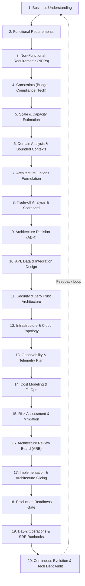

# Enterprise Architecture Workflow

This document codifies the end-to-end delivery lifecycle for enterprise architecture, detailing every phase from initial business problem discovery to Day-2 operations and continuous evolution.

---

## 1. End-to-End Architecture Lifecycle Flow

---

## 2. Phase-by-Phase Detailed Specification

### Phase 1: Business Understanding
* **Objective**: Establish the core business rationale, strategic goals, target user personas, and executive business KPIs.
* **Key Inputs**: Executive mandate, business capability models, commercial contracts, customer problem statements.
* **Core Activities**: Conduct stakeholder interviews, identify revenue/cost drivers, map high-level value streams.
* **Key Outputs**: Business Context Statement, Strategic Alignment Goals, Business Success Metrics (e.g., ARR, NPS, Time-to-Market).

### Phase 2: Requirements Analysis (Functional)
* **Objective**: Define crisp functional boundaries, core workflows, and system capabilities.
* **Key Inputs**: Product Requirement Documents (PRD), Business Requirement Documents (BRD), user stories.
* **Core Activities**: Decompose workflows into distinct use cases; establish actors, inputs, business rules, and outputs.
* **Key Outputs**: System Functional Specification, Core Domain Use Case Catalog.

### Phase 3: Non-Functional Requirements (NFRs)
* **Objective**: Quantify operational performance parameters that dictate system survivability.
* **Key Inputs**: Business SLAs, regulatory standards, customer expectations.
* **Core Activities**: Define the "-ilities" with hard numerical metrics:
  * **Latency**: p50, p95, p99 latency thresholds under peak load (e.g., `< 50ms` at p99).
  * **Throughput**: Normal vs. peak requests per second (RPS) and data volume.
  * **Availability**: 99.9% (8.76h downtime/yr) vs. 99.99% (52.6m downtime/yr).
  * **Durability & Recovery**: RPO (Recovery Point Objective) and RTO (Recovery Time Objective).
* **Key Outputs**: NFR Matrix, Service Level Objectives (SLOs).

### Phase 4: Constraints Identification
* **Objective**: Identify the real-world boundaries that limit technical choices.
* **Key Inputs**: Enterprise policies, regulatory frameworks, budgets, team composition.
* **Core Activities**: Audit four primary constraint pillars:
  1. *Regulatory & Compliance*: GDPR, HIPAA, PCI-DSS, SOC2, Data Residency.
  2. *Financial*: CapEx/OpEx limits, monthly cloud budget envelopes.
  3. *Organizational*: Team skillset, hiring timelines, current platform standards.
  4. *Technical*: Legacy systems, immovable mainframes, mandatory vendor integrations.
* **Key Outputs**: Architectural Constraints Register.

### Phase 5: Scale & Capacity Estimation
* **Objective**: Quantify resource demands from first principles before designing topology.
* **Key Inputs**: User base forecasts, data generation per action, retention periods.
* **Core Activities**:
  * *Storage Estimation*: `Daily Active Users * Actions/Day * Payload Size * Retention Period`.
  * *Bandwidth Estimation*: Incoming and outgoing bitrates during peak burst multipliers.
  * *Compute & Memory Estimation*: Working set size calculation for caching tiers (e.g., 80/20 rule).
  * *IOPS Calculation*: Read/write operations per second across primary and replica databases.
* **Key Outputs**: Capacity Plan & Resource Sizing Model.

### Phase 6: Domain Analysis & Bounded Contexts
* **Objective**: Partition business complexity into loosely coupled, highly cohesive subdomains.
* **Key Inputs**: Functional specifications, ubiquitous business terminology.
* **Core Activities**: Apply Strategic Domain-Driven Design (DDD):
  * Differentiate Core Domains, Supporting Domains, and Generic Domains.
  * Map Bounded Contexts and define Context Maps (Shared Kernel, Customer/Supplier, Anti-Corruption Layer).
* **Key Outputs**: Domain Bounded Context Diagram, Ubiquitous Language Glossary.

### Phase 7: Architecture Options Formulation
* **Objective**: Generate at least 2–3 viable, contrasting architectural approaches.
* **Key Inputs**: Constraints, scale calculations, domain boundaries.
* **Core Activities**: Frame distinct alternatives (e.g., Modular Monolith vs. Event-Driven Microservices; Serverless vs. Managed Containers; Distributed SQL vs. Relational + Caching).
* **Key Outputs**: Architecture Options Matrix.

### Phase 8: Trade-off Analysis
* **Objective**: Systematically evaluate each candidate option against the [Decision-Making Framework](DECISION-MAKING-FRAMEWORK.md).
* **Key Inputs**: Candidate options, NFR matrix, organizational constraints.
* **Core Activities**: Score options against latency, cost, complexity, cognitive overhead, and failure resilience. Document what each option *sacrifices*.
* **Key Outputs**: Trade-off Evaluation Matrix.

### Phase 9: Architecture Decision (ADR)
* **Objective**: Select the winning architectural path and formally commit the rationale.
* **Key Inputs**: Trade-off scorecard, stakeholder consensus.
* **Core Activities**: Draft an immutable [Architecture Decision Record](16-architecture-deliverables/ADR-TEMPLATE.md) detailing Context, Decision, Consequences, and Alternatives Rejected.
* **Key Outputs**: Approved ADR committed to repository.

### Phase 10: API, Data & Integration Design
* **Objective**: Formalize interface contracts, schemas, and persistence topology.
* **Key Inputs**: ADR, domain models, NFRs.
* **Core Activities**:
  * *API Contract*: OpenAPI (REST), Protobuf (gRPC), or GraphQL schema with strict semantic versioning.
  * *Data Architecture*: Relational vs. Document vs. Key-Value; primary keys, sharding keys, indexing, and WAL settings.
  * *Integration Protocols*: Event schemas (CloudEvents/Avro), pub/sub topics, idempotency tokens, dead letter queues.
* **Key Outputs**: API Specifications, Data Schema Models, Integration Contracts.

### Phase 11: Security & Zero Trust Architecture
* **Objective**: Build defense-in-depth and identity-centric security boundaries.
* **Key Inputs**: Compliance standards, network topology, threat profiles.
* **Core Activities**:
  * Threat Modeling using STRIDE (Spoofing, Tampering, Repudiation, Information Disclosure, Denial of Service, Elevation of Privilege).
  * AuthN/AuthZ blueprint: OAuth2 + OIDC, mTLS for east-west traffic, fine-grained RBAC/ABAC.
  * Data protection: TLS 1.3 in-transit, AES-256 at-rest with KMS envelope encryption.
* **Key Outputs**: Security Architecture Document, STRIDE Threat Model, Secrets Management Plan.

### Phase 12: Infrastructure & Cloud Topology
* **Objective**: Specify compute, network, and hosting infrastructure.
* **Key Inputs**: Capacity estimations, availability SLAs, cloud provider constraints.
* **Core Activities**:
  * Design multi-AZ / multi-region VPC topology, subnets, NAT gateways, peering links, and transit gateways.
  * Container orchestration (Kubernetes clusters, node pools, ingress controllers).
  * Infrastructure-as-Code (Terraform modules, GitOps deployment state).
* **Key Outputs**: Cloud Topology Diagram, Terraform Module Specifications.

### Phase 13: Observability & Telemetry Plan
* **Objective**: Engineer runtime visibility across the three telemetry pillars.
* **Key Inputs**: NFR latency budgets, critical transaction paths.
* **Core Activities**:
  * Define structured JSON logging standards with mandatory W3C distributed trace context (`traceparent`).
  * Establish Prometheus SLI metrics (RED method: Rate, Errors, Duration).
  * Define SLO alerting burn rates and synthetic health probing scripts.
* **Key Outputs**: Telemetry Design Specification, Dashboard Blueprints, Alerting Matrix.

### Phase 14: Cost Modeling & FinOps
* **Objective**: Prevent cloud bill surprises by forecasting multi-year operational spend.
* **Key Inputs**: Infrastructure topology, resource sizing, network egress models.
* **Core Activities**:
  * Calculate compute, managed database, storage, and cross-AZ/cross-region egress costs.
  * Identify cost optimization levers (Reserved Instances, Savings Plans, Spot instances, auto-scaling thresholds).
* **Key Outputs**: 3-Year Total Cost of Ownership (TCO) Model, FinOps Budget Envelope.

### Phase 15: Risk Assessment & Mitigation
* **Objective**: Identify systemic technical risks and define fallback contingencies.
* **Key Inputs**: Single points of failure (SPOF), vendor dependencies, novel technologies.
* **Core Activities**:
  * Score risks by Probability and Impact.
  * Document concrete mitigation actions and fallback contingency plans for every high-severity risk.
* **Key Outputs**: [Technical Risk Register](16-architecture-deliverables/RISK-REGISTER-TEMPLATE.md).

### Phase 16: Architecture Review Board (ARB)
* **Objective**: Formal governance review, validation against enterprise principles, and final sign-off.
* **Key Inputs**: Solution Architecture Document (SAD), ADRs, Security Model, Cost Model.
* **Core Activities**: Present architecture to principal peers and enterprise architects. Audit against [Architecture Review Checklist](21-architecture-tools/checklists/architecture-review-checklist.md).
* **Key Outputs**: ARB Approval / Conditional Remediation Requirements.

### Phase 17: Implementation & Architecture Slicing
* **Objective**: Translate architecture into vertical, deployable engineering milestones.
* **Key Inputs**: Approved architecture package, engineering team sprints.
* **Core Activities**:
  * Slice architecture into "Tracer Bullets" (end-to-end thin vertical slices proving integration).
  * Establish developer golden paths, scaffold repositories, and CI/CD pipelines.
* **Key Outputs**: Architecture Slicing Roadmap, Scaffolding Templates.

### Phase 18: Production Readiness Gate
* **Objective**: Verify system survivability, operational runbooks, and security before traffic cutover.
* **Key Inputs**: Staging environment, performance test results, DR drill outcomes.
* **Core Activities**: Execute [Production Readiness Checklist](21-architecture-tools/checklists/production-readiness-checklist.md):
  * Chaos/resilience testing (kill instances, sever network partitions).
  * Load and soak testing up to 2x peak forecasted traffic.
  * Disaster recovery failover drill (RTO/RPO validation).
* **Key Outputs**: Production Readiness Sign-off, Go-Live Cutover Runbook.

### Phase 19: Day-2 Operations & SRE Runbooks
* **Objective**: Hand off system to operational teams with automated runbooks and monitoring.
* **Key Inputs**: Telemetry dashboards, incident escalation trees.
* **Core Activities**: Author troubleshooting runbooks, configure automated rollback policies, train on-call engineers.
* **Key Outputs**: SRE Operational Runbooks, Escalation Matrix.

### Phase 20: Continuous Evolution & Tech Debt Audit
* **Objective**: Continuously audit system drift, evaluate tech debt, and modernize iteratively.
* **Key Inputs**: Production incident post-mortems, operational metrics, new business requirements.
* **Core Activities**: Conduct quarterly architecture health reviews, update the [Technology Radar](TECHNOLOGY-RADAR.md), and plan architectural refactoring waves.
* **Key Outputs**: Quarterly Architecture Review Report, Tech Debt Backlog.
