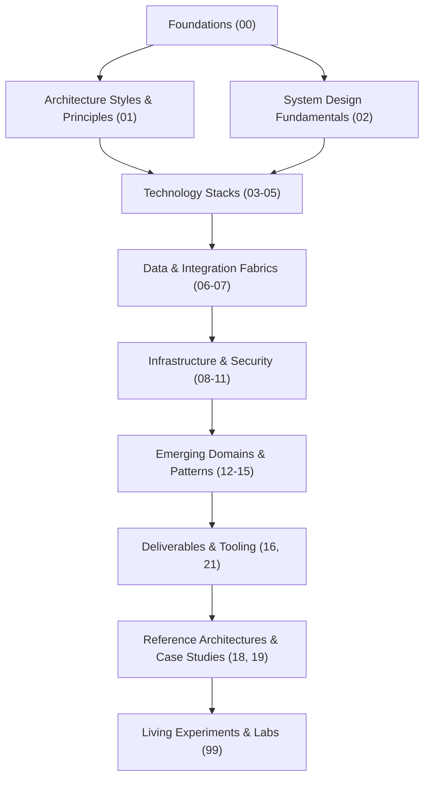
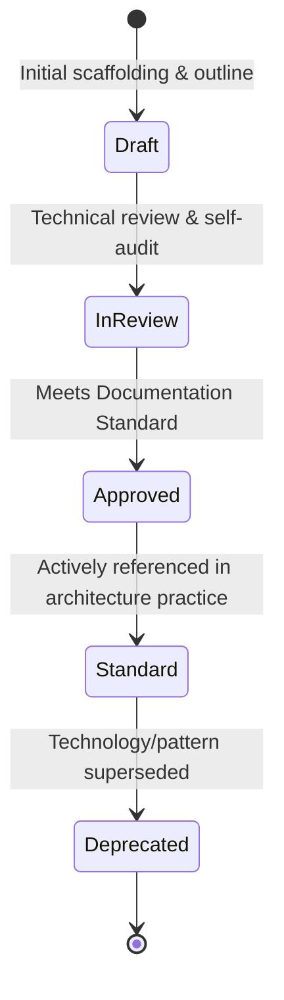

# Architecture of the Knowledge Repository

This document defines the architectural model, organizational taxonomy, lifecycle governance, and design mechanics of the `enterprise-architecture-handbook` repository itself.

---

## 1. Meta-Architecture & Design Goals

The knowledge repository is engineered with the same rigor applied to production enterprise software. It treats documentation as code, governed by high cohesion, low coupling, deterministic discoverability, and immutable lifecycle milestones.



### Core Design Goals
1. **Deterministic Discoverability**: A practitioner must locate any topic within three clicks from the root directory or master index.
2. **Strict Domain Boundaries**: Prevent domain bleed by enforcing high conceptual cohesion within numbered directories.
3. **Decoupled Evolution**: Sections can be iteratively authored and versioned without breaking adjacent documentation.
4. **Actionable Deliverables**: Maintain a direct pipeline between theoretical patterns, deliverable templates, review checklists, and practical experiments.

---

## 2. Numbering Strategy & Organization Model

The repository uses a **two-digit decimal prefix (`00` to `99`)** to establish a structured, logical sequence of abstraction levels:

| Prefix Band | Layer Name | Scope & Purpose |
| :--- | :--- | :--- |
| **`00`** | **Foundations** | Invariant computer science and distributed system fundamentals (OS, network, theory, databases). |
| **`01` - `02`** | **Architecture & System Design** | High-level architectural disciplines, methodology, and NFR engineering frameworks. |
| **`03` - `05`** | **Application Engineering** | Language runtimes, server-side frameworks, web platforms, and mobile clients. |
| **`06` - `07`** | **Data & Integration** | Persistence models, stream processing, APIs, messaging protocols, and integration fabrics. |
| **`08` - `11`** | **Platform, Security & Operations**| Cloud topologies, infrastructure automation, Zero Trust security, and observability. |
| **`12` - `15`** | **Advanced & Specialized Domains** | Artificial Intelligence, advanced distributed patterns, enterprise domain systems, and legacy modernization. |
| **`16` - `17`** | **Deliverables & Visuals** | Battle-tested document templates and C4 architecture diagram specifications. |
| **`18` - `20`** | **Blueprints, History & Interviews**| End-to-end industry reference architectures, real-world case studies, and interview playbooks. |
| **`21` - `22`** | **Tools & Standards** | Operational checklists, capacity calculators, scripts, glossaries, and technology radar archives. |
| **`99`** | **Sandbox & Labs** | Sandboxed code spikes, performance benchmarks, and empirical validations. |

---

## 3. Domain Boundaries & Separation of Concerns

To prevent documentation overlap and maintain conceptual purity:

* **Foundations (`00`) vs. Architecture Patterns (`13`)**: `00` details the theoretical baseline (e.g., CAP Theorem, Two-Phase Commit mechanics), whereas `13` details the practical architectural application (e.g., Saga Pattern with Orchestration vs. Choreography).
* **Integration (`07`) vs. Enterprise Integration (`14`)**: `07` focuses on technical integration protocols (Kafka, gRPC, REST, GraphQL), whereas `14` applies them to business enterprise systems (SAP ERP, Salesforce CRM, SWIFT banking, HL7 healthcare).
* **System Design (`02`) vs. Reference Architectures (`18`)**: `02` establishes generic system design building blocks (caching strategies, sharding, availability calculations), whereas `18` synthesizes these blocks into holistic, end-to-end industry systems (e.g., Global E-Commerce Platform SAD).
* **Reference Architectures (`18`) vs. Case Studies (`19`)**: `18` represents prescriptive, ideal-state reference blueprints; `19` documents descriptive, retrospective reality, including unforeseen production incidents, migrations, and tech debt remediation.

---

## 4. Cross-Referencing Mechanics

To maintain referential integrity without creating circular dependencies:

1. **Explicit Relative Links**: Always use relative GitHub-compatible Markdown paths (e.g., `[ADR Template](../../16-architecture-deliverables/ADR-TEMPLATE.md)`).
2. **Downward and Sideward References**:
   * Higher-level documents (e.g., SADs in `16`) reference lower-level patterns (`13`) and foundational principles (`00`, `01`).
   * Reference architectures (`18`) cite specific deliverables templates (`16`), architectural patterns (`13`), and checklists (`21`).
   * Case studies (`19`) link to post-mortems and corresponding reference designs.
3. **No Dead Links**: Every cross-reference must link to an existing markdown file or subdirectory.

---

## 5. Content Lifecycle Management

Every document in this handbook progresses through a defined lifecycle indicated in its document header metadata:



### Document Status Definitions
* **`DRAFT`**: Early outline or exploratory notes. Contains the mandatory document structure but some deep technical sections remain in progress.
* **`IN-REVIEW`**: Fully written technical document undergoing trade-off review against the [Documentation Standard](DOCUMENTATION-STANDARD.md) and [Checklists](21-architecture-tools/checklists/).
* **`APPROVED / STANDARD`**: Production-grade architectural reference. Complete with trade-offs, failure modes, scalability limits, and operational realities.
* **`DEPRECATED`**: Historical pattern or outdated technology (e.g., SOAP over JMS, XML-RPC). Retained solely for modernization and legacy migration context.

---

## 6. The Knowledge Hierarchy: Concepts, Patterns, Decisions, and Labs

How knowledge flows from theoretical concept to validated production architecture:

```text
Concept / Principle (00, 01)
         ↓
Architecture Pattern (13)
         ↓
Architecture Decision Record (ADR) (16)
         ↓
Reference Architecture / Solution Design (16, 18)
         ↓
Empirical Lab Validation / Benchmark (99)
         ↓
Production Deployment & Operational Checklist (21)
         ↓
Retrospective Case Study (19)
```

1. **Concepts & Principles (`00`, `01`)**: Establish the immutable physics of computing and enterprise architecture strategy.
2. **Patterns (`13`)**: Provide structured solutions to recurring distributed systems challenges.
3. **Decisions (`16-architecture-deliverables/adr/`)**: Capture concrete, contextual trade-offs made for a specific business requirement.
4. **Reference Architectures (`18`)**: Assemble patterns and components into complete, cohesive industry platforms.
5. **Experiments & Labs (`99`)**: Provide empirical code validation to prove throughput, latency, or integration hypotheses.
6. **Checklists (`21`)**: Gate production quality before go-live.
7. **Case Studies (`19`)**: Feed operational learnings and post-mortem realities back into principles and patterns.
