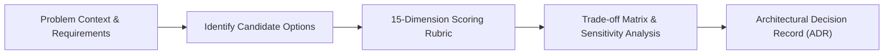

# Architecture Decision-Making Framework

This framework establishes an objective, rigorous, and repeatable methodology for evaluating architectural choices, technology selections, and structural trade-offs in enterprise systems.

---

## 1. The Decision Evaluation Philosophy

In software architecture, **there are no perfect solutions—only trade-offs**. Every design decision grants certain capabilities while demanding distinct sacrifices in latency, cost, complexity, operational burden, or flexibility.



The objective of this framework is not to eliminate trade-offs, but to make them **deliberate, transparent, measurable, and documented**.

---

## 2. The 15 Evaluation Dimensions

Every candidate architectural option must be systematically scored across 15 core dimensions:

```text
┌────────────────────────────────────────────────────────────────────────┐
│                   15 ARCHITECTURAL DIMENSIONS                          │
├────────────────────────────────┬───────────────────────────────────────┤
│ 1. Business Value              │ 9.  Reliability & Resiliency          │
│ 2. Functional Alignment        │ 10. Maintainability & Code Health     │
│ 3. Non-Functional Performance  │ 11. Team Capability & Cognitive Load  │
│ 4. Hard Constraints Alignment  │ 12. Operational Complexity            │
│ 5. Technical & Delivery Risk   │ 13. Vendor Lock-In & Portability      │
│ 6. Total Cost of Ownership     │ 14. Time-to-Market (TTM)              │
│ 7. Security & Compliance       │ 15. Future Evolution & Extensibility  │
│ 8. Scalability & Elasticity    │                                       │
└────────────────────────────────┴───────────────────────────────────────┘
```

### Detailed Rubric Breakdown

#### 1. Business Value & Strategic Alignment
* **Criterion**: How directly does this option accelerate core strategic KPIs (revenue, customer retention, regulatory compliance, competitive differentiation)?
* **Score 1 (Poor)**: Purely technical vanity project; negligible or negative business return.
* **Score 5 (Superior)**: Directly unlocks high-value business capabilities; immediate ROI.

#### 2. Functional Requirements (FR) Coverage
* **Criterion**: Does the option natively satisfy all core functional requirements without requiring hacky workarounds?
* **Score 1 (Poor)**: Requires substantial custom code or fragile glue layers to satisfy basic use cases.
* **Score 5 (Superior)**: Natively supports all required functional use cases out-of-the-box.

#### 3. Non-Functional Requirements (NFR) Performance
* **Criterion**: Does the option comfortably meet latency budgets (p95/p99), throughput targets, and concurrency limits?
* **Score 1 (Poor)**: Struggles to hit basic p95 latency targets under synthetic load.
* **Score 5 (Superior)**: Consistently outperforms p99 latency and throughput thresholds with headroom.

#### 4. Constraints Alignment
* **Criterion**: Does the option respect enterprise policies, existing contracts, data sovereignty laws, and mandatory technological baselines?
* **Score 1 (Poor)**: Violates regulatory boundaries or mandatory enterprise compliance policies.
* **Score 5 (Superior)**: Fully aligned with all regulatory, legal, and enterprise constraints.

#### 5. Technical & Delivery Risk
* **Criterion**: What is the probability of unforeseen bugs, maturity gaps, community abandonment, or integration failure?
* **Score 1 (High Risk)**: Pre-v1.0 open-source library, unproven vendor, or poorly documented architecture.
* **Score 5 (Low Risk)**: Industry-standard, mature, battle-tested technology with massive production track record.

#### 6. Total Cost of Ownership (TCO & FinOps)
* **Criterion**: What is the holistic cost including software licensing, cloud compute/storage, data egress, and engineering salaries?
* **Score 1 (Prohibitive)**: Extreme ongoing licensing or runaway cloud consumption costs.
* **Score 5 (Cost-Efficient)**: Highly cost-effective; predictable, sub-linear cost scaling as traffic grows.

#### 7. Security, Privacy & Zero Trust
* **Criterion**: Does the option support least-privilege access, granular encryption (in-transit/at-rest), audit logging, and modern auth (OIDC/mTLS)?
* **Score 1 (Insecure)**: Lacks role-based access, requires cleartext credentials, or has history of unpatched CVEs.
* **Score 5 (Hardened)**: Enterprise-grade security baseline, SOC2/HIPAA ready, Zero-Trust native.

#### 8. Scalability & Elasticity
* **Criterion**: Can the architecture scale horizontally without hitting hard architectural bottlenecks (e.g., global locks, single leader choke points)?
* **Score 1 (Unscalable)**: Hard vertical scaling limits; catastrophic contention under burst traffic.
* **Score 5 (Hyper-Scalable)**: Linear horizontal scale with decoupled compute and storage.

#### 9. Reliability, Fault Tolerance & Resiliency
* **Criterion**: How does the system handle partial hardware failures, network partitions, or downstream outages?
* **Score 1 (Fragile)**: Downstream failure causes cascading system collapse; manual intervention required to recover.
* **Score 5 (Self-Healing)**: Graceful degradation, automatic failovers, circuit breakers, and zero data loss.

#### 10. Maintainability & Code Health
* **Criterion**: How easy is it for an engineer to modify, refactor, write unit tests for, and understand the code over a 5-year lifecycle?
* **Score 1 (Spaghetti)**: High coupling, opaque abstractions, difficult to test locally, high regression rates.
* **Score 5 (Clean)**: Modular, testable, strictly typed, clean boundaries, rapid test feedback loops.

#### 11. Team Capability & Cognitive Load
* **Criterion**: Does the engineering team currently possess the skills to build and maintain this, or can they learn it rapidly without drowning in cognitive overhead?
* **Score 1 (Overwhelmed)**: Requires specialized niche PhD skills (e.g., writing custom Raft engines) not present on the team.
* **Score 5 (Empowered)**: Aligns with current team expertise; intuitive developer ergonomics.

#### 12. Operational Complexity
* **Criterion**: What is the Day-2 operational overhead (monitoring, patching, upgrading, backup verification, on-call alert burden)?
* **Score 1 (Operational Nightmare)**: 20 moving parts, frequent midnight alerts, complex multi-step disaster recovery.
* **Score 5 (Turnkey Operability)**: Fully automated observability, robust health endpoints, automated self-healing.

#### 13. Vendor Lock-In & Portability
* **Criterion**: How difficult and costly would it be to migrate away from this technology if commercial terms or requirements change?
* **Score 1 (Total Lock-In)**: Proprietary API semantics, non-standard query languages, impossible data export.
* **Score 5 (Open Standards)**: Built on open standards (PostgreSQL wire format, OCI containers, OpenTelemetry).

#### 14. Time-to-Market (TTM)
* **Criterion**: How quickly can the team deliver a production-ready, MVP version of the system to customers?
* **Score 1 (Slow)**: Multi-quarter scaffolding required before a single business feature can be deployed.
* **Score 5 (Rapid)**: Rapid prototyping and delivery enabled by rich ecosystem and pre-built primitives.

#### 15. Future Evolution & Extensibility
* **Criterion**: Does this decision paint the organization into an architectural corner, or does it leave doors open for future modular evolution?
* **Score 1 (Rigid Dead-End)**: Structural coupling prevents future changes without total rewrites.
* **Score 5 (Evolvable)**: Loose coupling and clean contracts allow components to be replaced incrementally.

---

## 3. Weighted Decision Matrix Template

When evaluating competing architectural options (e.g., Option A vs. Option B vs. Option C), utilize a weighted scoring matrix where weights ($W_i$) reflect the specific project context ($\sum W_i = 100\%$):

| Dimension | Context Weight (%) | Option A Score (1-5) | Option A Weighted | Option B Score (1-5) | Option B Weighted | Option C Score (1-5) | Option C Weighted |
| :--- | :---: | :---: | :---: | :---: | :---: | :---: | :---: |
| 1. Business Value | 10% | 4 | 0.40 | 4 | 0.40 | 3 | 0.30 |
| 2. Functional Alignment | 10% | 5 | 0.50 | 4 | 0.40 | 4 | 0.40 |
| 3. NFR Performance | 10% | 4 | 0.40 | 5 | 0.50 | 3 | 0.30 |
| 4. Constraints Alignment | 5% | 5 | 0.25 | 4 | 0.20 | 5 | 0.25 |
| 5. Technical Risk | 5% | 4 | 0.20 | 3 | 0.15 | 4 | 0.20 |
| 6. Total Cost (TCO) | 10% | 3 | 0.30 | 2 | 0.20 | 5 | 0.50 |
| 7. Security & Compliance | 10% | 5 | 0.50 | 5 | 0.50 | 4 | 0.40 |
| 8. Scalability | 5% | 4 | 0.20 | 5 | 0.25 | 3 | 0.15 |
| 9. Reliability | 5% | 4 | 0.20 | 5 | 0.25 | 3 | 0.15 |
| 10. Maintainability | 5% | 4 | 0.20 | 3 | 0.15 | 4 | 0.20 |
| 11. Team Capability | 10% | 5 | 0.50 | 2 | 0.20 | 4 | 0.40 |
| 12. Operational Complexity | 5% | 4 | 0.20 | 2 | 0.10 | 4 | 0.20 |
| 13. Vendor Lock-In | 2% | 3 | 0.06 | 2 | 0.04 | 5 | 0.10 |
| 14. Time-to-Market | 5% | 4 | 0.20 | 2 | 0.10 | 4 | 0.20 |
| 15. Future Evolution | 3% | 4 | 0.12 | 4 | 0.12 | 3 | 0.09 |
| **TOTAL** | **100%** | — | **4.23** | — | **3.56** | — | **3.84** |

---

## 4. Sensitivity & Failure Mode Analysis

A numerical score is insufficient on its own. The architect must conduct two qualitative stress tests before finalizing:

### The "Fatal Flaw" Veto Test
If an option scores a **1** on Security, Compliance, Constraints, or Team Capability, it is automatically disqualified, regardless of how high its composite score is across other categories.

### The "Cost of Reversal" Test
Evaluate whether the decision is a **Type 1 (One-Way Door)** or **Type 2 (Two-Way Door)** decision:
* **Type 1 (Irreversible / Expensive to reverse)**: e.g., Choosing a primary database engine, programming language ecosystem, or distributed consistency model. Requires deep ARB review and rigorous prototyping.
* **Type 2 (Reversible / Inexpensive to reverse)**: e.g., Choosing an internal caching library, API serialization format, or specific dashboard tool. Authorize team to execute rapidly.

---

## 5. Decision Output: The Mandatory ADR

Once the winning option is selected:
1. Complete the [Architecture Decision Record (ADR)](16-architecture-deliverables/ADR-TEMPLATE.md).
2. Explicitly document **what trade-offs were accepted** and **which options were rejected and why**.
3. Commit the ADR into `16-architecture-deliverables/adr/` alongside the system codebase.
