# How to Use the Enterprise Architecture Handbook — Architect Operating Guide

> **A practical navigation, execution, and operating layer for Solution Architects, Technical Architects, Enterprise Architects, and Principal Engineers.**

---

## 1. Executive Purpose

The **Enterprise Architecture Handbook** contains thousands of pages of deep architectural standards, patterns, reference architectures, calculators, and production case studies. However, **knowledge without an operating model creates cognitive overload**.

This guide answers the core practitioner question:

> **"I have a concrete problem. Which part of this repository should I use, in what sequence, and what artifact should I produce?"**

`HOW-TO-USE.md` does not duplicate architectural theory. It serves as the **control plane** and **execution playbook** over the knowledge base.

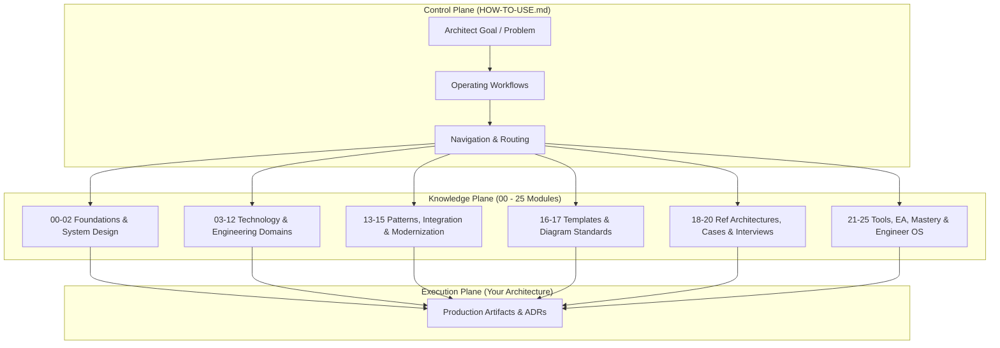

---

## 2. The Master Operating Model

The repository should **never be consumed linearly** from `00` to `24`. Doing so treats architecture as academic trivia rather than contextual engineering. 

Architecture is an iterative decision lifecycle driven by concrete business and technical drivers:

```mermaid
flowchart LR
    Goal["Goal / Problem"] --> Assess["Assess Constraints"]
    Assess --> Learn["Targeted Research"]
    Learn --> Design["Formulate Options"]
    Design --> Decide["Evaluate Trade-offs"]
    Decide --> Document["Author Deliverables"]
    Document --> Review["Peer Review (ARB/ATAM)"]
    Review --> Implement["Delivery & Testing"]
    Implement --> Operate["Production Telemetry"]
    Operate --> Incident["Incident / Post-Mortem"]
    Incident --> Update["Refine Handbook & ADRs"]
    Update -.-> Goal
```

---

## 3. Quick Start: If You Are New to This Repository

If you are exploring the handbook for the first time, follow this progressive onboarding sequence:

```text
README.md (Understand philosophy & tenets)
  ↓
HOW-TO-USE.md (Understand operating model & workflows)
  ↓
01-architecture/ & 00-foundations/ (Anchor on first principles & governance)
  ↓
02-system-design/ (Master scalability, consistency, and NFR engineering)
  ↓
Select Your Domain Focus (e.g., 08-cloud, 06-data, 12-ai, 14-enterprise-integration)
  ↓
18-reference-architectures/ (Study end-to-end industry implementations)
  ↓
19-case-studies/ (Analyze real-world post-mortems and failure modes)
  ↓
21-architecture-tools/ (Leverage CLI generators, linters, and review checklists)
  ↓
Apply on Real Architecture Initiatives (Author ADRs, HLDs, and SADs)
```

---

## 4. "I Want To..." Master Navigation Matrix

Use this routing table to jump directly to the authoritative domain for your immediate task:

| I Want To... | Primary Knowledge Domain | Key Output / Deliverable |
| :--- | :--- | :--- |
| **Learn core architecture disciplines & governance** | [`01-architecture/`](./01-architecture/README.md) | Architecture Guiding Principles & ARB Charter |
| **Master distributed systems fundamentals & OS internals** | [`00-foundations/`](./00-foundations/) | Concurrency & Network Latency Models |
| **Engineer high availability, consistency, & NFRs** | [`02-system-design/`](./02-system-design/README.md) | Non-Functional Requirements (NFR) Matrix |
| **Design high-throughput backend services** | [`03-backend/`](./03-backend/README.md) | Backend Architecture Blueprint & Runtime Specs |
| **Architect enterprise web apps & micro-frontends** | [`04-frontend/`](./04-frontend/README.md) | Micro-Frontend Module Federation Specs |
| **Design mobile platforms & offline-first sync** | [`05-mobile/`](./05-mobile/README.md) | Mobile Security & CRDT Sync Topologies |
| **Build data platforms, lakehouses, & vector search** | [`06-data/`](./06-data/README.md) | Data Model, Pipeline & Storage Topologies |
| **Design event streams, APIs, & message brokers** | [`07-integration/`](./07-integration/README.md) | API Gateway & Async Messaging Architecture |
| **Architect multi-cloud topologies & FinOps controls** | [`08-cloud/`](./08-cloud/README.md) | Cloud Landing Zone & FinOps Unit Economics |
| **Build CI/CD pipelines, GitOps, & Kubernetes platforms** | [`09-devops/`](./09-devops/README.md) | Platform Engineering Blueprint & IaC Modules |
| **Implement Zero Trust, IAM, & Threat Modeling** | [`10-security/`](./10-security/README.md) | STRIDE Threat Model & Zero Trust Posture |
| **Establish telemetry, OpenTelemetry, & SLOs** | [`11-observability/`](./11-observability/README.md) | Observability Dashboard & Error Budget Policy |
| **Deploy enterprise LLMs, RAG, & AI agents** | [`12-ai/`](./12-ai/README.md) | Enterprise GenAI Serving & Evaluation Spec |
| **Apply DDD, Event Sourcing, CQRS, & Sagas** | [`13-architecture-patterns/`](./13-architecture-patterns/README.md) | Domain Context Map & Distributed Saga Design |
| **Integrate ERP (SAP), CRM (Salesforce), & Banking** | [`14-enterprise-integration/`](./14-enterprise-integration/README.md) | Core Banking, EDI, SAP, & Salesforce HLDs |
| **Decompose legacy monoliths & migrate databases** | [`15-modernization/`](./15-modernization/README.md) | Strangler Fig Migration & Cutover Runbook |
| **Author production ADRs, SADs, HLDs, or LLDs** | [`16-architecture-deliverables/`](./16-architecture-deliverables/README.md) | Standard Architecture Deliverables Package |
| **Create standard C4 model & network diagrams** | [`17-diagrams/`](./17-diagrams/README.md) | C4 Context, Container, & Component Diagrams |
| **Study production reference architectures** | [`18-reference-architectures/`](./18-reference-architectures/README.md) | Industry-Specific Target Solution Blueprints |
| **Review outages, incident retros, & scaling lessons** | [`19-case-studies/`](./19-case-studies/README.md) | Architecture Failure & Resilience Post-Mortems |
| **Prepare for Principal/Staff/Architect interviews** | [`20-interview-system-design/`](./20-interview-system-design/README.md) | System Design Interview Framework & Rubrics |
| **Run CLI generators, linters, & review checklists** | [`21-architecture-tools/`](./21-architecture-tools/README.md) | Executable ADR Generators, Linters, Audits |
| **Look up protocols, acronyms, & cloud service maps** | [`22-reference/`](./22-reference/README.md) | Multi-Cloud Matrix & Protocol Reference |
| **Align IT strategy, capabilities, & TOGAF models** | [`23-enterprise-architecture/`](./23-enterprise-architecture/README.md) | Business Capability Map & APM Scorecards |
| **Develop executive presence, judgment, & leadership** | [`24-architect-mastery/`](./24-architect-mastery/README.md) | Career Progression & Executive Communication |
| **Continuously improve software engineering excellence** | [`25-engineer-excellence/`](./25-engineer-excellence/README.md) | Engineer OS, Competency Models, IDP & Evidence |
| **Run prototypes & architectural spikes (Sandbox)** | [`99-experiments/`](./99-experiments/)* | Benchmark Code & Architectural Prototypes |

*\*Note: `99-experiments/` is an active experimental sandbox currently under staged provisioning.*

---

## 5. Core Architectural Workflows

### 5.1. How to Learn a New Architecture Topic

When acquiring capability in a new architectural domain, follow this deliberate discovery loop:

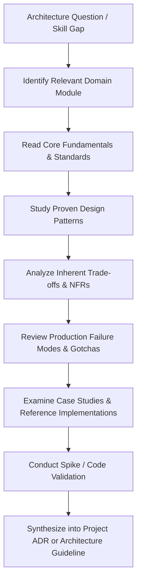

#### Practical Routing Examples:
* **Event-Driven Architecture (EDA)**:
  `Question` → [`07-integration/`](./07-integration/README.md) (Message broker selection) → [`02-system-design/consistency/`](./02-system-design/consistency/README.md) (Eventual consistency) → [`13-architecture-patterns/event-driven/`](./13-architecture-patterns/README.md) (Outbox & Saga patterns) → [`19-case-studies/`](./19-case-studies/README.md) (Real-world consumer lag outages) → [`16-architecture-deliverables/ADR-TEMPLATE.md`](./16-architecture-deliverables/ADR-TEMPLATE.md).
* **Enterprise GenAI / RAG**:
  `Question` → [`12-ai/`](./12-ai/README.md) (vLLM, continuous batching, RAG architectures) → [`06-data/search/`](./06-data/search/README.md) (HNSW vector indexing) → [`10-security/`](./10-security/README.md) (Prompt injection & data leakage) → [`11-observability/`](./11-observability/README.md) (LLM latency & token cost monitoring).
* **Core Cloud Modernization**:
  `Question` → [`15-modernization/`](./15-modernization/README.md) (Strangler Fig pattern) → [`08-cloud/`](./08-cloud/README.md) (Multi-cloud landing zones & FinOps) → [`09-devops/`](./09-devops/README.md) (GitOps & Kubernetes migration) → [`18-reference-architectures/`](./18-reference-architectures/README.md) (Cloud-native target architecture).

---

### 5.2. Real-World Architecture Project Workflow

When leading an end-to-end architecture engagement from inception to production operations:

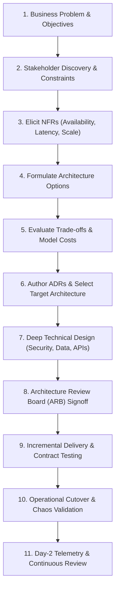

#### Cross-Repository Engagement Map:
1. **Requirements & Scope**: Use [`01-architecture/`](./01-architecture/README.md) for stakeholder alignment and [`02-system-design/functional-requirements/`](./02-system-design/functional-requirements/README.md).
2. **NFR Elicitation**: Generate targets with [`21-architecture-tools/generators/nfr_matrix_generator.py`](./21-architecture-tools/generators/nfr_matrix_generator.py) and study [`02-system-design/availability/`](./02-system-design/availability/README.md).
3. **Decisions & Trade-offs**: Use [`DECISION-MAKING-FRAMEWORK.md`](./DECISION-MAKING-FRAMEWORK.md) and generate ADRs via [`21-architecture-tools/generators/adr_generator.py`](./21-architecture-tools/generators/adr_generator.py).
4. **Target Architecture Documentation**: Author deliverables using [`16-architecture-deliverables/SOLUTION-ARCHITECTURE-TEMPLATE.md`](./16-architecture-deliverables/SOLUTION-ARCHITECTURE-TEMPLATE.md) and diagram with [`17-diagrams/c4/`](./17-diagrams/README.md).
5. **Cross-Cutting Concerns**: Secure via [`10-security/`](./10-security/README.md), scale via [`08-cloud/`](./08-cloud/README.md), and instrument via [`11-observability/`](./11-observability/README.md).
6. **Production Readiness**: Execute [`21-architecture-tools/checklists/solution-architecture-checklist.md`](./21-architecture-tools/README.md).

---

### 5.3. Architecture Decision Workflow (ADR Lifecycle)

Architecture is not the absence of doubt; it is the **disciplined evaluation of trade-offs**:

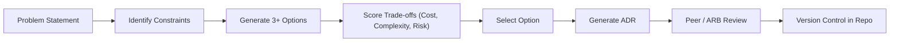

#### Execution Steps:
1. Review the axioms in [`ARCHITECTURE-PRINCIPLES.md`](./ARCHITECTURE-PRINCIPLES.md).
2. Consult [`DECISION-MAKING-FRAMEWORK.md`](./DECISION-MAKING-FRAMEWORK.md) for objective multi-variable scoring.
3. Check technology viability in [`TECHNOLOGY-RADAR.md`](./TECHNOLOGY-RADAR.md) (Adopt, Trial, Assess, Hold).
4. Generate the ADR using the CLI tool:
   ```powershell
   python 21-architecture-tools/generators/adr_generator.py --title "Adopt Event-Driven Architecture for Fulfillment" --author "Platform Architecture"
   ```
5. Store the resulting ADR in your project repository or [`16-architecture-deliverables/01-adr/`](./16-architecture-deliverables/README.md).

---

### 5.4. Architecture Documentation & Deliverable Selection

Do not write 100-page monolithic documents that nobody reads. Produce **purpose-built artifacts** mapped to specific audience needs:

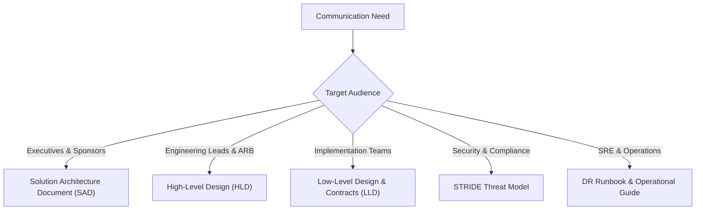

#### Deliverable Guide:
* **SAD (Solution Architecture Document)**: Business capability alignment, end-to-end scope, system context, and budget impact. [Template](./16-architecture-deliverables/SOLUTION-ARCHITECTURE-TEMPLATE.md).
* **HLD (High-Level Design)**: Subsystem decomposition, C4 Containers, integration protocols, and data models. [Template](./16-architecture-deliverables/HLD-TEMPLATE.md).
* **LLD (Low-Level Design)**: Database schemas, API endpoints, serialization formats, concurrency locks. [Template](./16-architecture-deliverables/LLD-TEMPLATE.md).
* **ADR (Architecture Decision Record)**: Single-decision justification documenting context, drivers, and consequences. [Template](./16-architecture-deliverables/ADR-TEMPLATE.md).
* **Threat Model**: STRIDE analysis, trust boundaries, encryption in transit/rest. [Template](./21-architecture-tools/templates/threat-model-stride-template.md).
* **Disaster Recovery Runbook**: RTO/RPO targets, active-active or active-passive failover procedure. [Template](./21-architecture-tools/templates/disaster-recovery-runbook-template.md).
* *For complete artifact selection criteria, review [Deliverable Selection Guide](./16-architecture-deliverables/deliverable-selection-guide.md).*

---

### 5.5. Architecture Review Workflow (ARB & ATAM)

An architecture review is **not a technology popularity contest**. Its sole objective is to verify whether an architecture will satisfy business outcomes under severe production constraints:

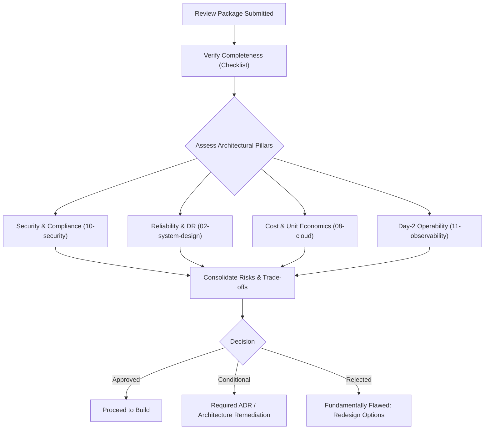

* Use [`16-architecture-deliverables/ARCHITECTURE-REVIEW-TEMPLATE.md`](./16-architecture-deliverables/ARCHITECTURE-REVIEW-TEMPLATE.md) to structure the review package.
* Use [`21-architecture-tools/checklists/`](./21-architecture-tools/README.md) to audit gaps before presenting to the board.

---

### 5.6. Modernization & Monolith Decomposition Workflow

When untangling legacy enterprise systems, avoid big-bang rewrites:

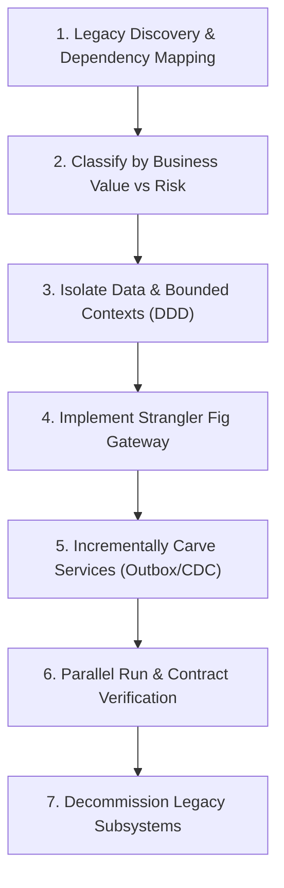

#### Domain Combinations for Modernization:
* Decomposition strategies: [`15-modernization/`](./15-modernization/README.md).
* Bounded contexts & domain events: [`13-architecture-patterns/`](./13-architecture-patterns/README.md).
* Enterprise system connectors (SAP, CRM, Core Banking): [`14-enterprise-integration/`](./14-enterprise-integration/README.md).
* Dual-write mitigation and database replication: [`06-data/`](./06-data/README.md).

---

### 5.7. Reference Architecture Workflow

The architectures in [`18-reference-architectures/`](./18-reference-architectures/README.md) represent battle-tested production topologies for FinTech, E-Commerce, Healthcare, and SaaS.

> **Crucial Rule: A reference architecture is a starting point, never a copy-paste production design.**

```text
Identify Similar Industry Reference Architecture (18-reference-architectures/)
  ↓
Review Architectural Assumptions (Scale, Compliance, Budget, Team Structure)
  ↓
Compare Against Your Organization's Unique Constraints
  ↓
Isolate Differences (Latency requirements, Data Sovereignty, Cloud Vendor)
  ↓
Adapt Topology & Document Delta in an ADR
```

---

### 5.8. Case Study & Failure Analysis Workflow

Case studies teach **consequences, second-order effects, and judgment**:

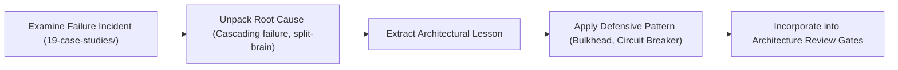

---

### 5.9. Architectural Spike & Experiment Workflow

When an architectural decision involves severe technology uncertainty or high blast radius, run a controlled experiment in [`99-experiments/`](./99-experiments/):

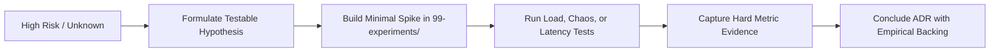

*Note: Experiments must have a defined hypothesis, stopping criteria, and measurable success metrics. They are not open-ended prototypes.*

---

### 5.10. Production Incident to Architecture Learning

Architecture does not end at deployment. Production failures are the primary empirical input for updating standards:

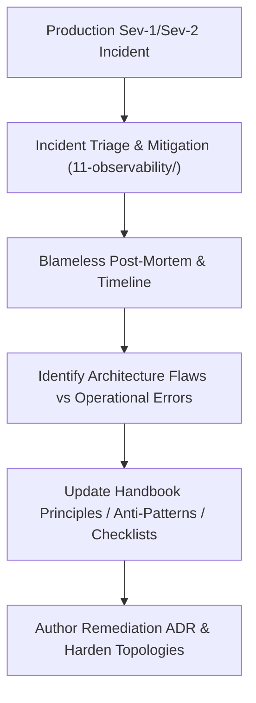

---

### 5.11. System Design & Architect Interview Preparation

When preparing for Senior, Staff, Principal, or Enterprise Architect interviews:

```text
20-interview-system-design/ (Framework, Estimation, & Leadership Rubrics)
  + 02-system-design/ (Availability, Consistency, Fault Tolerance)
  + 18-reference-architectures/ (High-scale concrete enterprise topologies)
  + 19-case-studies/ (Real-world disaster recovery and failure narratives)
  + 21-architecture-tools/ (Calculators for storage, QPS, and network bandwidth)
  + 24-architect-mastery/ (Executive leadership, trade-off articulation, ambiguity)
```

The goal in architectural interviews is **not memorizing diagrams**, but demonstrating structured problem decomposition, stakeholder alignment, and trade-off defense under pressure.

---

### 5.12. Engineer to Architect Career Progression

For senior software engineers transitioning into architecture leadership:

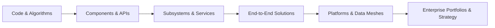

* Study the career competencies, influence models, and leadership principles in [`24-architect-mastery/`](./24-architect-mastery/README.md).
* Elevate focus from *how to build it* to *what problem we are solving, what trade-offs we are accepting, and what it costs to own for the next 7 years*.

---

## 6. "When I Don't Know What to Do" (The Stuck Protocol)

When confronted with overwhelming ambiguity, conflicting executive mandates, or unfamiliar technologies:

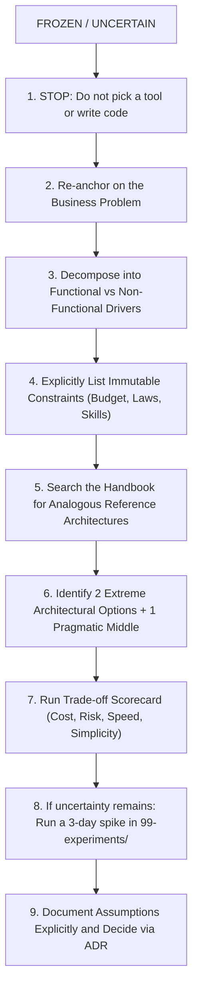

> **First-Principles Axiom**: "I don't know" is a completely acceptable response from a chief architect—provided it is immediately followed by: *"Here is our deliberate 48-hour plan to eliminate that uncertainty."*

---

## 7. Repository Usage Anti-Patterns

To maximize the practical value of this handbook, **avoid these common traps**:

| Anti-Pattern | Why It Fails | What to Do Instead |
| :--- | :--- | :--- |
| **Linear Reading** | Treating 5,000+ files as a linear novel causes burnout and low retention. | Read **on-demand** driven by a concrete engineering project, ADR, or learning goal. |
| **Resume-Driven Design** | Selecting hot technologies (Kafka, Kubernetes, LLMs) before understanding requirements. | Let the **NFRs and business constraints** dictate the architecture. Choose boring technology when viable. |
| **Copy-Paste Reference Designs**| Deploying an enterprise reference architecture without adapting to your team's operational maturity. | Use reference architectures as **starting inspirations**; adjust for scale and team cognitive capacity. |
| **Omitting Trade-offs** | Documenting only the pros of a chosen pattern while hiding costs and complexity. | Every ADR and design must explicitly state **what is sacrificed** (e.g., consistency sacrificed for availability). |
| **Academic Over-Engineering** | Writing 60-page Word documents for systems that could be described in a 3-page HLD. | Use **modular templates** in [`16-architecture-deliverables/`](./16-architecture-deliverables/README.md) and right-size documentation. |
| **Ivory Tower Architecture** | Whiteboarding diagrams without validating network latency, disk I/O, or failure modes. | Validate critical assumptions via **empirical spikes** and review production post-mortems in [`19-case-studies/`](./19-case-studies/README.md). |

---

## 8. The Continuous Feedback Flywheel

A high-performing architecture practice operates as an **empirical learning flywheel**:

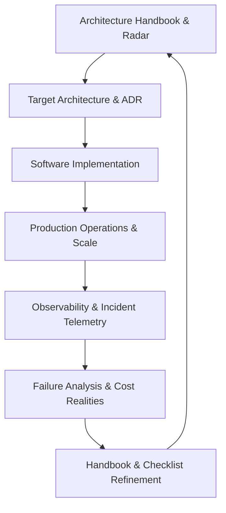

When a system fails in production, the failure is rarely code syntax—it is almost always an unmodeled architectural assumption. When that occurs:
1. Update the **Failure Modes** section in the relevant domain.
2. Add a verification question to the **Architecture Review Checklist**.
3. Record a new blip or status change on the **Technology Radar**.

---

## 9. Vision: The Architect Operating System

This handbook is designed to evolve beyond static documentation into an **AI-augmented Architect Operating System (AOS)**:

```text
Knowledge Repository (Structured Markdown, ADRs, Topologies)
        ↓
Architect Operating System (Workflows, CLI Tools, Linting, Checklists)
        ↓
Architecture Intelligence (RAG over ADRs, Vector Search, Automated ARB)
        ↓
Copilot / Decision Support (Interactive Trade-off Simulation & Cost Projections)
```

By maintaining strict structural schemas, clean relative links, and machine-readable markdown, the repository is ready for programmatic consumption, automated governance linters, and AI-assisted design reviews.

---

## 10. Summary Checklist for Practitioners

Before closing this guide and starting your work:

- [ ] Have you identified the exact business problem you are solving?
- [ ] Have you elicited measurable NFRs (P99 latency, availability %, RPO/RTO)?
- [ ] Have you checked [`18-reference-architectures/`](./18-reference-architectures/README.md) for similar patterns?
- [ ] Have you generated an ADR using `python 21-architecture-tools/generators/adr_generator.py`?
- [ ] Have you audited your proposed design against [`21-architecture-tools/checklists/`](./21-architecture-tools/README.md)?
- [ ] Have you validated that all diagrams follow standard C4 models in [`17-diagrams/`](./17-diagrams/README.md)?
