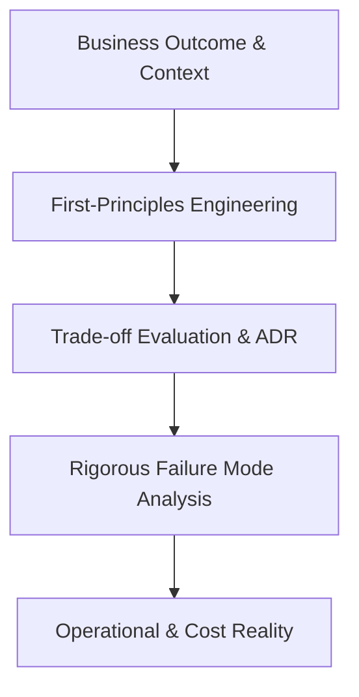

# Enterprise Architecture Handbook

A definitive, long-term engineering reference, decision framework, and architecture playbook for modern Solution Architects, Enterprise Architects, and Principal Engineers designing mission-critical, high-scale enterprise platforms.

---

## 1. Executive Summary & Purpose

The **Enterprise Architecture Handbook** bridges the gap between high-level enterprise business strategy and deep, battle-tested systems engineering. Built from the crucible of global Fortune 500 digital transformations, large-scale multi-cloud migrations, high-throughput distributed systems, and modern cloud-native architectures, this repository serves as:

1. **A Living Single Source of Truth (SSOT)**: Authoritative architectural standards, patterns, governance principles, and technology radars.
2. **A Production-Ready Deliverables Kit**: Battle-tested templates for Architecture Decision Records (ADRs), High-Level Designs (HLD), Low-Level Designs (LLD), Security Threat Models, API Contracts, and System Designs.
3. **An Operational Execution Engine**: Real-world review checklists, trade-off evaluation frameworks, scale calculators, and production readiness gates.
4. **A Career Architecture Playbook**: Deep scenario analyses, failure modes, trade-off scorecards, and system design interviews for senior technical leadership.

---

## 2. Target Audience

This handbook is calibrated for practitioners operating at the intersection of business complexity and distributed systems:

* **Enterprise Architects (EAs)**: Aligning multi-million dollar technology portfolios with strategic business capabilities, roadmaps, and enterprise governance.
* **Solution Architects (SAs)**: Designing end-to-end resilient, compliant, and cost-optimized system architectures across polyglot ecosystems.
* **Domain & Application Architects**: Leading domain-driven decomposition, API ecosystems, and core platform modularity.
* **Principal & Staff Engineers**: Implementing distributed systems, event-driven pipelines, zero-trust security postures, and low-latency data layers.
* **Cloud & Platform Engineers**: Orchestrating Kubernetes, multi-cloud topologies, infrastructure-as-code, and automated developer platforms.

---

## 3. The Architecture-First Philosophy

This repository rejects hype cycles, hand-waving abstractions, and shallow textbook definitions. Every architecture pattern, reference model, and decision document adheres to the **Real-World Engineering Tenets**:

1. **Business-First, Technology-Second**: Technology is a depreciation liability unless it delivers concrete business capability, competitive advantage, or risk mitigation.
2. **First-Principles Reasoning**: Ground decisions in fundamental constraints—network latency, CAP theorem, disk I/O, memory cache lines, and team cognitive load.
3. **Explicit Trade-offs**: There are no solutions in software architecture; there are only trade-offs. If a document does not document what is *sacrificed*, it is incomplete.
4. **Failure as a Certainty**: Complex distributed systems operate in a constant state of partial degradation. Resiliency, circuit breakers, idempotency, and bulkhead isolation must be designed in from Day 0.
5. **Operational Operability**: Architecture is validated in production at 3:00 AM on a Sunday. Observability, automated runbooks, mean time to recovery (MTTR), and Day-2 maintainability outweigh elegant whiteboard designs.

---

## 4. Master Navigation & Knowledge Domains

The repository is structured into logically decoupled, numerically prefixed domains to guarantee strict modularity and hierarchical clarity:

| Domain Index | Knowledge Area | Description | Direct Link |
| :--- | :--- | :--- | :--- |
| **`00`** | **Foundations** | First principles: Distributed systems theory, OS internals, networking, databases, security fundamentals. | [00-foundations](./00-foundations/) |
| **`01`** | **Architecture** | Disciplines of EA, SA, Application, Integration, Data, Cloud, Security, and AI architecture governance. | [01-architecture](./01-architecture/) |
| **`02`** | **System Design** | Scalability, availability, consistency models, fault tolerance, DR, capacity planning, and NFR engineering. | [02-system-design](./02-system-design/) |
| **`03`** | **Backend** | Enterprise runtimes (.NET, Java/Spring, Python, Node.js) and high-concurrency backend patterns. | [03-backend](./03-backend/) |
| **`04`** | **Frontend** | Modern web architecture (React, Angular, TypeScript), micro-frontends, design systems, and web performance. | [04-frontend](./04-frontend/) |
| **`05`** | **Mobile** | React Native, native mobile ecosystems, offline-first sync, push notifications, and mobile security. | [05-mobile](./05-mobile/) |
| **`06`** | **Data** | Polyglot persistence, SQL/NoSQL internals, data lakes, warehousing, stream processing, search, governance. | [06-data](./06-data/) |
| **`07`** | **Integration** | Synchronous (REST, GraphQL, gRPC) & asynchronous (Kafka, RabbitMQ) integration, API gateways, webhooks. | [07-integration](./07-integration/) |
| **`08`** | **Cloud** | AWS, Azure, GCP, multi-cloud, hybrid topology, cloud-native patterns, and FinOps cloud cost optimization. | [08-cloud](./08-cloud/) |
| **`09`** | **DevOps** | Git workflows, CI/CD pipelines, Docker, Kubernetes, Terraform, Ansible, and Platform Engineering. | [09-devops](./09-devops/) |
| **`10`** | **Security** | Zero Trust, OAuth2/OIDC, mTLS, cryptography, secrets management, threat modeling (STRIDE), DevSecOps. | [10-security](./10-security/) |
| **`11`** | **Observability** | Telemetry pillars (Logs, Metrics, Traces), OpenTelemetry, SLO/SLA management, incident triage. | [11-observability](./11-observability/) |
| **`12`** | **AI / GenAI** | Enterprise LLM integration, RAG architectures, multi-agent systems, vector DBs, AI evaluation, and AI security. | [12-ai](./12-ai/) |
| **`13`** | **Architecture Patterns** | Microservices, Modular Monoliths, Event-Driven Architecture (EDA), CQRS, Event Sourcing, Saga, DDD. | [13-architecture-patterns](./13-architecture-patterns/) |
| **`14`** | **Enterprise Integration** | Industry ERP, CRM, Core Banking, Payments, Insurance, Healthcare, Logistics, and supply chain systems. | [14-enterprise-integration](./14-enterprise-integration/) |
| **`15`** | **Modernization** | Strangler Fig, legacy monolith decomposition, database migration, on-prem to cloud transformation. | [15-modernization](./15-modernization/) |
| **`16`** | **Deliverables & Templates** | Battle-tested templates for ADRs, SADs, HLDs, LLDs, Security, Data, Deployment, and Review packages. | [16-architecture-deliverables](./16-architecture-deliverables/) |
| **`17`** | **Diagrams** | C4 Model (Context, Container, Component, Code), network, deployment, and sequence diagrams. | [17-diagrams](./17-diagrams/) |
| **`18`** | **Reference Architectures**| End-to-end architectures for E-Commerce, FinTech, Healthcare, SaaS, Logistics, Marketplaces, AI. | [18-reference-architectures](./18-reference-architectures/) |
| **`19`** | **Case Studies** | Post-mortems, hyper-growth scale stories, complex migrations, and real-world failure analyses. | [19-case-studies](./19-case-studies/) |
| **`20`** | **Interview System Design**| Staff/Principal/Architect-level design challenges, trade-off inquiries, and leadership scorecards. | [20-interview-system-design](./20-interview-system-design/) |
| **`21`** | **Architecture Tools** | Production review checklists, capacity calculators, linters, templates, and diagram generators. | [21-architecture-tools](./21-architecture-tools/) |
| **`22`** | **Reference** | Architectural glossaries, acronym decoders, technology comparison matrices, and protocol specs. | [22-reference](./22-reference/) |
| **`99`** | **Experiments** | Sandboxed prototypes, benchmarks, architectural spikes, and distributed system labs. | [99-experiments](./99-experiments/) |

*For complete document-level navigation across all topics, visit the [Master Index](INDEX.md).*

---

## 5. Core Governance & Methodology Documents

Before authoring or consuming architectural artifacts in this repository, review the core governance baselines:

* [Architecture Principles](ARCHITECTURE-PRINCIPLES.md) — 15 Non-negotiable architectural axioms governing all system designs.
* [Architecture Workflow](ARCHITECTURE-WORKFLOW.md) — End-to-end delivery lifecycle from business problem to Day-2 operations.
* [Decision-Making Framework](DECISION-MAKING-FRAMEWORK.md) — Multi-dimensional rubric for objective technology and pattern selection.
* [Documentation Standard](DOCUMENTATION-STANDARD.md) — Mandatory structural schema for all technical documentation.
* [Technology Radar](TECHNOLOGY-RADAR.md) — Living portfolio of technologies categorized by Adopt, Trial, Assess, and Hold.
* [Repository Architecture](ARCHITECTURE.md) — Structure, taxonomy, cross-referencing rules, and lifecycle management.
* [Handbook Roadmap](ROADMAP.md) — 10-Phase roadmap guiding the evolution of this repository.
* [Contribution Guide](CONTRIBUTING.md) — Rigorous hygiene, naming conventions, and validation gates.
* [Changelog](CHANGELOG.md) — Chronological ledger of architectural iterations.

---

## 6. How to Navigate and Use This Handbook

### When Designing a New System
1. Study the [Architecture Workflow](ARCHITECTURE-WORKFLOW.md) for sequence and phase gates.
2. Formulate NFRs using [02-system-design/non-functional-requirements/](02-system-design/non-functional-requirements/).
3. Pull the [Solution Architecture Template](16-architecture-deliverables/SOLUTION-ARCHITECTURE-TEMPLATE.md).
4. Select components using the [Decision-Making Framework](DECISION-MAKING-FRAMEWORK.md) and [Technology Radar](TECHNOLOGY-RADAR.md).
5. Document key inflection points using the [ADR Template](16-architecture-deliverables/ADR-TEMPLATE.md).
6. Run self-assessments using the [Solution Architecture Checklist](21-architecture-tools/checklists/solution-architecture-checklist.md).

### When Modernizing an Existing Monolith
1. Review modern migration patterns in [15-modernization/](15-modernization/).
2. Apply Domain-Driven Design bounded contexts from [13-architecture-patterns/domain-driven-design/](13-architecture-patterns/domain-driven-design/).
3. Validate data decomposition strategies via [15-modernization/database-modernization/](15-modernization/database-modernization/).
4. Check cutover and fallback readiness with the [Disaster Recovery Checklist](21-architecture-tools/checklists/disaster-recovery-checklist.md).

---

## 7. Mandatory Content Rules

To guarantee that this repository remains an elite engineering handbook and never degenerates into a superficial dictionary:

> **Every technical write-up must address:**
> 1. What concrete problem does this solve?
> 2. When should you use it (explicit fit indicators)?
> 3. When should you **NOT** use it (anti-patterns and disqualifiers)?
> 4. What are the competing alternatives?
> 5. What are the explicit trade-offs (latency, cost, cognitive overhead, consistency)?
> 6. What failure modes occur in production, and how are they handled?
> 7. How does it scale, and what are its limits?
> 8. What are the security, compliance, and data governance implications?
> 9. What does it cost to operate (FinOps) and maintain?

---

## 8. Maintenance & Evolution

This handbook evolves organically alongside enterprise technology shifts. All modifications adhere to the phased progression defined in [ROADMAP.md](ROADMAP.md).
