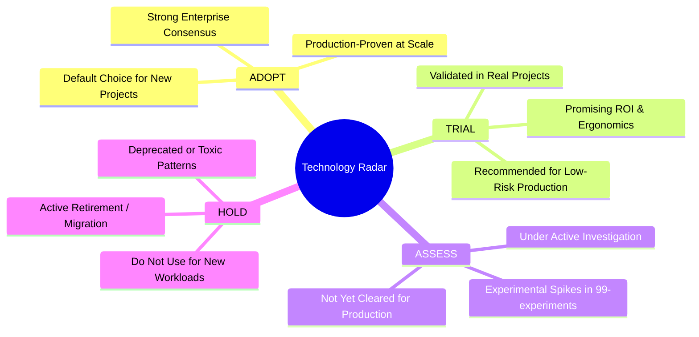

# Enterprise Technology Radar

> **Status**: Living Architecture Artifact  
> **Last Review Date**: 2026-09  
> **Cadence**: Quarterly Review  
> **Governing Body**: Enterprise Architecture Review Board (ARB)

The **Enterprise Technology Radar** tracks technologies, tools, frameworks, and patterns across our engineering ecosystem. It guides architectural selection, prevents fragmentation, controls technical debt, and provides clear signals on platform evolution.

> [!NOTE]
> This radar serves as a baseline starting point for Phase 1. It requires periodic quarterly review and consensus before any technology transitions between rings.

---

## 1. Radar Ring Definitions



* **ADOPT**: Technologies with proven track records, mature enterprise tooling, established security posture, and deep organizational capability. **Default recommendation for new production systems.**
* **TRIAL**: Successfully proven in production spikes or non-critical systems. Demonstrates clear business or operational advantages. **Recommended for pilot projects.**
* **ASSESS**: High-potential technologies being actively investigated via architectural spikes in [`99-experiments/`](99-experiments/). **Not yet approved for general production.**
* **HOLD**: Legacy, declining, unmaintainable, or overly complex technologies. **Strictly prohibited for new projects; existing footprints must plan migration paths.**

---

## 2. Technology Quadrants

### Quadrant I: Languages & Runtimes

| Ring | Technology | Primary Use Case | Architectural Notes |
| :--- | :--- | :--- | :--- |
| **ADOPT** | **.NET 8+ / C#** | High-performance enterprise services, core APIs | High throughput, minimal memory footprint, cross-platform. |
| **ADOPT** | **Java 21+ / Spring Boot 3** | Mission-critical enterprise backend platforms | Virtual threads (Loom), robust ecosystem, mature tooling. |
| **ADOPT** | **TypeScript 5+** | Full-stack web, BFF, and typed NodeJS services | Compile-time safety, universal developer ergonomics. |
| **ADOPT** | **Python 3.11+ / FastAPI** | Machine Learning, GenAI, data engineering | Standard ML ecosystem, high developer velocity. |
| **TRIAL** | **Go (Golang)** | High-concurrency network proxies, low-latency microservices | Minimal runtime footprint, rapid startup, zero GC pauses on small heaps. |
| **TRIAL** | **Rust** | Mission-critical low-latency kernels, cryptography | Zero-cost abstractions, memory safety without GC. |
| **ASSESS** | **Mojo** | AI compute acceleration, hardware-level optimization | Promising Python-compatible superset for high-performance AI. |
| **HOLD** | **Java 8 / Java 11** | Legacy enterprise applications | End of mainstream support; migrate to Java 21 LTS. |
| **HOLD** | **.NET Framework 4.x** | Legacy Windows-only services | High licensing costs, containerization friction; migrate to modern .NET. |
| **HOLD** | **PHP / Ruby on Rails** | Legacy monoliths | Phasing out for enterprise core services in favor of typed runtimes. |

---

### Quadrant II: Platforms, Cloud & Infrastructure

| Ring | Technology | Primary Use Case | Architectural Notes |
| :--- | :--- | :--- | :--- |
| **ADOPT** | **Kubernetes (EKS / AKS / GKE)** | Enterprise container orchestration | Cloud-agnostic standard for microservices and workloads. |
| **ADOPT** | **Terraform / OpenTofu** | Declarative Infrastructure-as-Code (IaC) | State-driven multi-cloud orchestration standard. |
| **ADOPT** | **Docker / OCI Distroless** | Immutable container packaging | Minimal attack surface, reproducible multi-stage builds. |
| **ADOPT** | **ArgoCD** | Declarative GitOps deployment engine | Eliminates direct cluster access; git-driven state synchronization. |
| **TRIAL** | **AWS Graviton / ARM64** | Cost-optimized compute instances | 20–40% price-performance gain over x86 for modern runtimes. |
| **TRIAL** | **Cilium / eBPF** | High-performance CNI and Kubernetes security | Kernel-level observability, network policy enforcement, and load balancing. |
| **ASSESS** | **WebAssembly (Wasm) on Server** | Edge compute and ultra-fast micro-sandboxes | Near-instant startup times and platform neutrality. |
| **HOLD** | **ClickOps (Manual Cloud Setup)** | Ad-hoc cloud provisioning | Strict zero-tolerance; causes configuration drift and audit failure. |
| **HOLD** | **Self-Hosted Kubernetes on Bare Metal** | Generic container workloads | Unsustainable operational maintenance burden; prefer managed cloud services. |

---

### Quadrant III: Data, Persistence & Messaging

| Ring | Technology | Primary Use Case | Architectural Notes |
| :--- | :--- | :--- | :--- |
| **ADOPT** | **PostgreSQL 16+** | Relational OLTP, general persistence | Outstanding reliability, JSONB flexibility, rich extensions. |
| **ADOPT** | **Redis (Cluster / Managed)** | Distributed cache, session store, rate limiting | Sub-millisecond read/write latency, atomic data structures. |
| **ADOPT** | **Apache Kafka** | Event streaming, high-throughput event logs | Immutable append log, replayability, enterprise event backbone. |
| **ADOPT** | **Snowflake / BigQuery** | Cloud data warehousing & analytics | Decoupled compute and storage, SQL-standard analytics. |
| **TRIAL** | **Distributed SQL (CockroachDB)** | Multi-region active-active relational data | Strong serializable consistency across global geographic regions. |
| **TRIAL** | **Apache Iceberg** | Open table format for analytical data lakes | Acid transactions on object storage; engine-agnostic format. |
| **TRIAL** | **Qdrant / pgvector** | Vector similarity search for RAG systems | Efficient embedding retrieval for LLM context augmentation. |
| **ASSESS** | **DuckDB** | In-process OLAP analytics and local processing | Extremely fast vectorized analytics on local files/parquet. |
| **HOLD** | **Raw Shared Databases Across Services** | Multi-service communication | Violates bounded contexts; introduces tight coupling and schema lock-in. |
| **HOLD** | **MongoDB for Pure Relational Workloads** | Entity persistence | Avoid forcing relational integrity into document models; use PostgreSQL. |

---

### Quadrant IV: Integration, Security & Observability

| Ring | Technology | Primary Use Case | Architectural Notes |
| :--- | :--- | :--- | :--- |
| **ADOPT** | **OpenTelemetry (OTel)** | Vendor-neutral telemetry instrumentation | Unified standard for distributed traces, metrics, and structured logs. |
| **ADOPT** | **OAuth2 / OIDC** | Enterprise identity, SSO, API token validation | RFC-standardized token authentication and user delegation. |
| **ADOPT** | **HashiCorp Vault / Cloud KMS** | Secrets management and envelope encryption | Dynamic secrets, automated credential rotation, centralized audit. |
| **ADOPT** | **Prometheus & Grafana** | Metrics scraping, SLI/SLO dashboards | Cloud-native standard for operational alerting. |
| **TRIAL** | **gRPC / Protocol Buffers** | High-performance inter-service communication | Binary serialization, multiplexed HTTP/2, contract-first design. |
| **TRIAL** | **Open Policy Agent (OPA) / Styra** | Unified policy-as-code enforcement | Declarative fine-grained authorization across API and infrastructure. |
| **ASSESS** | **GraphQL Federation (Apollo v2)** | Multi-team frontend unified graph layer | Requires strict schema governance to avoid N+1 and performance traps. |
| **HOLD** | **Unstructured Plaintext Logging** | Application logs | Deprecated; all logs must be structured JSON with trace correlation IDs. |
| **HOLD** | **Long-Lived Hardcoded API Keys** | Service-to-service authentication | High security liability; replace with short-lived tokens and mTLS. |

---

## 3. Technology Lifecycle Review Process

The Technology Radar is reviewed quarterly by the Enterprise Architecture Review Board:

```text
Discovery / Proposal (via 99-experiments)
        ↓
Evaluation in Pilot Project (TRIAL)
        ↓
ARB Review & Enterprise Consensus (ADOPT)
        ↓
Retirement Notice & Migration Wave (HOLD)
```

1. **Nomination**: Any Principal Engineer or Architect may nominate an item for `ASSESS` or `TRIAL` by providing a prototype in `99-experiments/` and drafting an ADR.
2. **Transitioning to ADOPT**: Requires at least two successful production deployments and a complete operational runbook.
3. **Placing on HOLD**: Items placed on HOLD must include an explicit migration target and an estimated deprecation timeline.
